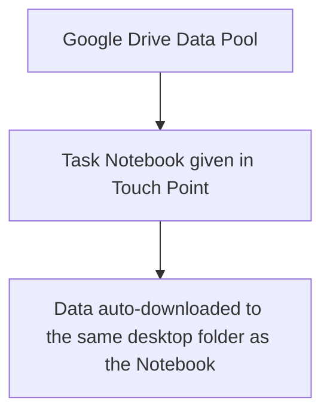
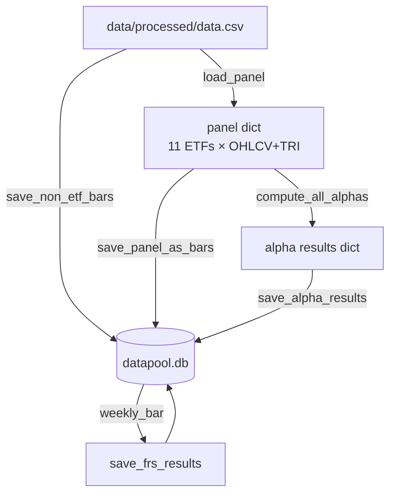

# Data Infra

## Workflow

## Data Pipeline

## SQLite Schema

### asset — ticker master
| ticker | security_name | category |
|--------|--------------|----------|
| XLB | XLB US Equity | ETF |
| XLC | XLC US Equity | ETF |
| XLE | XLE US Equity | ETF |
| XLF | XLF US Equity | ETF |
| XLI | XLI US Equity | ETF |
| XLK | XLK US Equity | ETF |
| XLP | XLP US Equity | ETF |
| XLU | XLU US Equity | ETF |
| XLV | XLV US Equity | ETF |
| XLRE | XLRE US Equity | ETF |
| XLY | XLY US Equity | ETF |
| SPY | SPY US Equity | Benchmark |
| SPX | SPX Index | Benchmark |
| VIX | VIX Index | Index |
| USGG10YR | USGG10YR Index | Index |

### alpha — factor registry
| alpha_id | alpha_name | applicable |
|----------|------------|------------|
| 1 … N | formula description | GroupA / GroupB |

### frs — FRS metric registry
| frs_id | note |
|--------|------|
| 1 | 4-week total return |
| 2 | 4-week Sharpe ratio proxy |
| 3 | 4-week volatility-penalised return |

### daily_bar — all 15 assets
| date | ticker | open | high | low | close | volume | tri |
|------|--------|------|------|-----|-------|--------|-----|

`PK (date, ticker)` · FK: ticker → asset

### weekly_bar — all 15 assets, W-WED resampled
| date | ticker | open | high | low | close | volume | tri |
|------|--------|------|------|-----|-------|--------|-----|

`PK (date, ticker)` · FK: ticker → asset

### weekly_alpha — ETF-only, long format
| date | ticker | alpha_id | value |
|------|--------|----------|-------|

`PK (date, ticker, alpha_id)` · FK: ticker → asset, alpha_id → alpha

### weekly_frs — ETF-only, long format
| date | ticker | frs_id | value |
|------|--------|--------|-------|

`PK (date, ticker, frs_id)` · FK: ticker → asset, frs_id → frs

---

## Asset Coverage

| Table | ETF (×11) | Benchmark (×2) | Index (×2) |
|-------|-----------|----------------|------------|
| daily_bar | ✓ | ✓ | ✓ |
| weekly_bar | ✓ | ✓ | ✓ |
| weekly_alpha | ✓ | — | — |
| weekly_frs | ✓ | — | — |

---

## FRS Definitions

Time window: next **4 Wednesday close prices** (weekly TRI series)

| Code | Name | Formula |
|------|------|---------|
| FRS1 | Total Return | (P₄ − P₀) / P₀ |
| FRS2 | Sharpe Ratio | avg(r₁…r₄) / std(r₁…r₄) |
| FRS3 | Vol-Penalty Return | FRS1 − β × std(r₁…r₄), β = 2.0 |
