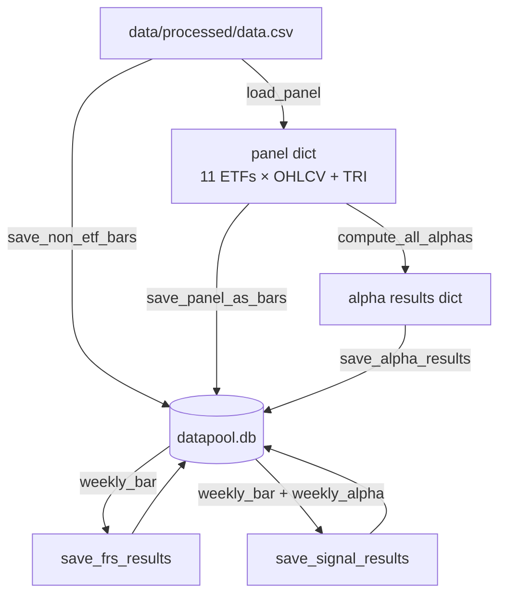

# Data Infra

High-level reference for the QuantLab datapool: where data lives, how it flows into SQLite, and what each table stores. Schema is defined in `src/QuantLab/utils/db.py` and created by `init_db()`.

**Developer guide (how to register / extend FRS, alpha, signal):** see `docs/02 Data Instruction.md`.

---

## Workflow

```mermaid
flowchart TB
    A[Google Drive Data Pool] --> B[Task notebook (touch point)]
    B --> C[Data downloaded next to the notebook]
    C --> D[data/processed/data.csv]
    D --> E[SQLite datapool.db]
```

---

## Data pipeline



**Orchestration:** `scripts/dataset_builder.ipynb` runs this pipeline end-to-end (bars → alphas → FRS → signals).

---

## SQLite schema (`datapool.db`)

### `asset` — ticker master

| ticker | security_name | category |
|--------|---------------|----------|
| XLB | XLB US Equity | ETF |
| XLC | XLC US Equity | ETF |
| XLE | XLE US Equity | ETF |
| XLF | XLF US Equity | ETF |
| XLI | XLI US Equity | ETF |
| XLK | XLK US Equity | ETF |
| XLP | XLP US Equity | ETF |
| XLU | XLU US Equity | ETF |
| XLV | XLV US Equity | ETF |
| XLRE | XLRE US Equity | ETF |
| XLY | XLY US Equity | ETF |
| SPY | SPY US Equity | Benchmark |
| SPX | SPX Index | Benchmark |
| VIX | VIX Index | Index |
| USGG10YR | USGG10YR Index | Index |

### `alpha` — factor registry

| alpha_id | alpha_name | applicable |
|----------|------------|------------|
| 1 … N | formula / description | A / B / custom |

**Write policy:** new `alpha_id` rows are **appended** only; existing registry rows are not deleted when re-running `save_alpha_results`.

### `frs` — FRS metric registry

| frs_id | note |
|--------|------|
| 1 | 4-week total return |
| 2 | 4-week Sharpe ratio proxy |
| 3 | 4-week volatility-penalised return |

**Write policy:** new `frs_id` rows are **appended** only when re-running `save_frs_results`.

### `signal` — signal registry

| signal_id | note | category |
|----------:|------|----------|
| 1 … N | description | `ML` · `alpha` · `composite` |

Signals are registered in code (`QuantLab.signal`). **Write policy:** new `signal_id` rows are **appended** only when re-running `save_signal_results`.

### `daily_bar` — all 15 assets

| date | ticker | open | high | low | close | volume | tri |
|------|--------|------|------|-----|-------|--------|-----|

`PK (date, ticker)` · `FK: ticker → asset`

### `weekly_bar` — all 15 assets, W–WED resampled

| date | ticker | open | high | low | close | volume | tri |
|------|--------|------|------|-----|-------|--------|-----|

`PK (date, ticker)` · `FK: ticker → asset`

### `weekly_alpha` — ETF-only, long format

| date | ticker | alpha_id | value |
|------|--------|----------|-------|

`PK (date, ticker, alpha_id)` · `FK: ticker → asset`, `alpha_id → alpha`

**Values:** `save_alpha_results` replaces all rows in `weekly_alpha` on each run (full refresh of factor values).

### `weekly_frs` — ETF-only, long format

| date | ticker | frs_id | value |
|------|--------|--------|-------|

`PK (date, ticker, frs_id)` · `FK: ticker → asset`, `frs_id → frs`

**Values:** `save_frs_results` replaces all rows in `weekly_frs` on each run.

### `weekly_signal` — ETF-only, long format

| date | ticker | signal_id | value |
|------|--------|-----------|-------|

`PK (date, ticker, signal_id)` · `FK: ticker → asset`, `signal_id → signal`

**Values:** `save_signal_results` deletes existing rows **per `signal_id`**, then appends the recomputed series for that id (other signals’ rows are preserved).

---

## Asset coverage

| Table | ETF (×11) | Benchmark (×2) | Index (×2) |
|-------|-----------|----------------|------------|
| daily_bar | ✓ | ✓ | ✓ |
| weekly_bar | ✓ | ✓ | ✓ |
| weekly_alpha | ✓ | — | — |
| weekly_frs | ✓ | — | — |
| weekly_signal | ✓ | — | — |

---

## FRS definitions

Time horizon: **four forward weekly steps** on the Wednesday-to-Wednesday TRI series (implementation uses `shift(-4)` on weekly TRI; see `QuantLab.frs.frs_metrics`).

| Code | Name | Formula (conceptual) |
|------|------|----------------------|
| FRS1 | Total return | (Pₜ₊₄ / Pₜ) − 1 |
| FRS2 | Sharpe proxy | mean(r) / std(r) over the 4-week window |
| FRS3 | Vol-penalised return | FRS1 − β × std(r), β = 2.0 |

---

## Code pointers

| Concern | Location |
|---------|----------|
| Schema + `init_db` | `src/QuantLab/utils/db.py` |
| Bars + panel load | `src/QuantLab/utils/data_loader.py` |
| Alpha compute / persist | `src/QuantLab/alpha/compute_alpha.py` |
| FRS compute / persist | `src/QuantLab/frs/compute_frs.py` |
| Signal compute / persist | `src/QuantLab/signal/compute_signal.py` |
| ML feature table (bar + alpha, pandas pivot) | `src/QuantLab/utils/load_ml_input.py` |
