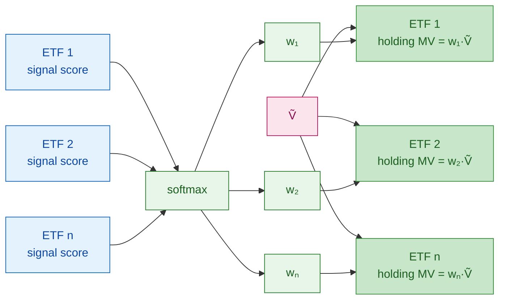
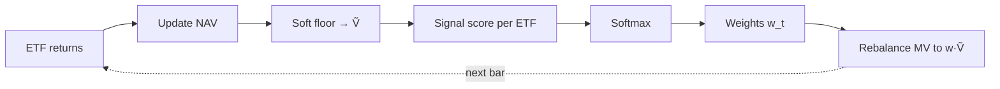

# Signal Optimization — Architecture

**Code:** `SiganlOptimizationStrategy` (long-only softmax allocator, soft floor, frictionless rebalance).

Step 1 screening results → `01_step1_screening.md`

---

## 0. Equal-Weight Benchmark (Baseline)

Before tuning any signal, establish a **frictionless equal-weight ETF baseline** as the mandatory floor for all Sharpe comparisons.

**Definition:** at every rebalance date, set $w_i = 1/N$ for all $N$ tradable ETFs. Equivalent to running `SiganlOptimizationStrategy` with a constant signal score for every ETF, since $\text{softmax}(c,\ldots,c) = [1/N,\ldots,1/N]$.

**Why equal-weight:** equal-weight is a strong null hypothesis for an ETF allocator — naive, cheap, and empirically hard to beat on a risk-adjusted basis. A signal that cannot beat it adds no value.

**Implemented by:** `OptimizationTestSignal` (all scores = 1.0) + `SiganlOptimizationStrategy` in `backtests/signal_optimization/smoketest/`.

**Comparison table (report for every optimization run):**

| Metric | Equal-Weight (§0) | Strategy | Δ |
|--------|:-----------------:|:--------:|:-:|
| Sharpe Ratio | | | |
| Annual Return | | | |
| Annual Volatility | | | |
| Max Drawdown | | | |
| Turnover (ann.) | | | |

Use `QuantLab.backtest.benchmark.compare_metrics(baseline, candidate)` to populate this table.

---

## 1. Portfolio Strategy

**Universe:** tradable ETFs at each rebalance date. **Long only.**

**Input:** one signal score per ETF, $s_i$ (higher → larger intended weight).

**Weights:** softmax over the ETF cross-section,

$$w_i = \frac{\exp(s_i)}{\sum_j \exp(s_j)}, \qquad w_i > 0,\ \sum_i w_i = 1.$$

**Dollar targets:** target market value in ETF $i$ is $w_i \tilde{V}$ (after soft floor).

**Orders:** $d_i = w_i\tilde{V} - \text{mv}_i$. Buy if $d_i > 0$, sell if $d_i < 0$ (frictionless, fractional notionals).

### Signal score → softmax → holdings



### Period spine



---

## 2. Soft Floor (Numerical Continuity)

$$\tilde{V}_t = \max(V_t,\,\varepsilon), \quad \varepsilon = 10^{-6}$$

Implementation: `cash = max(cash, eps)` with `eps = 1e-6` on the deployable equity variable. The floor is a **continuity device**, not an economic claim — required to keep gradient-based paths defined in Step 3.

---

## 3. Backtest Objective

**Primary objective:** $\mathcal{L} = \text{Sharpe}(\text{portfolio})$

- Turnover is **not** in the objective — reported as informational only.
- All runs: zero fee, zero slippage unless a friction study is specified.
- A run that does not beat §0 on Sharpe is **unsuccessful** regardless of absolute return.

**Reported but not optimised:** turnover (ann.), max drawdown, CAPM alpha vs SPY, win rate.

---

## 4. Optimization Steps

`SiganlOptimizationStrategy` consumes one signal score vector per date. The steps below are ways to produce or tune that vector — each scored by §3 vs §0.

| Step | What is optimized | Method | Must beat |
|------|-------------------|--------|-----------|
| 0 | — (equal weight) | — | — |
| 1 | Single signal (or tiny param set) | IC screen + grid sweep | Step 0 |
| 2 | Linear mix $\sum_k \alpha_k g^{(k)}$ + low-dim hyperparams | Bayesian opt + walk-forward CV | Steps 0–1 |
| 3 | Network parameters $\theta$ → per-ETF logits | SGD / Adam + differentiable backtest | Steps 0–2 |

**Step 1:** IC pre-screen (mean IC < 0.02 or IC-IR < 0.3 → prune). Grid/manual sweep on signal knobs.

**Step 2:** Bayesian optimization (TPE/GP), 50–200 trials. Regularize: $\sum_k |\alpha_k| \leq C$. Walk-forward CV to detect overfitting.

**Step 3:** Shallow MLP (2–3 layers) over lagged factor features → logits as signal scores into softmax. L2 + dropout; clip grad norm to 1.0. Avoid hard argsort/top-k to preserve gradient flow.

---

## 5. Differentiability

**Step 3** requires scores smooth in $\theta$ and a continuous path (soft floor, no hard sort / integer lots). **Steps 1–2** treat the backtest as a black box.

---

## Long Power / Short Power Framework

A signal that performs well in long-only softmax does **not** necessarily work on the short side.

| Metric | Definition | Backtests |
|--------|-----------|-----------|
| **Long Power (LP)** | Sharpe of `mode="long"` run (softmax over raw scores) | `backtests/signal_optimization/long_only/` |
| **Short Power (SP)** | Sharpe of `mode="short"` run (softmax over negated scores) | `backtests/signal_optimization/short_only/` |

**Decision rule for L/S candidacy:**
- LP > EW **and** SP > EW → L/S candidate
- LP > EW, SP ≤ EW → long-only signal
- LP ≤ EW, SP > EW → pure short signal (use as inverted long)
- Both ≤ EW → discard

**Integration with steps:**
```
Step 1
  ├── long_only/   → Long Power (LP)
  ├── short_only/  → Short Power (SP)
  └── LP + SP combined → filter candidates for Step 2 / trading_opt
```

**Backtest directory layout:**
```
backtests/signal_optimization/
├── smoketest/          Equal-weight baseline (set MODE=long or short)
├── long_only/
│   ├── alphas/run.py   LP sweep — all alpha_ids
│   └── step1/run.py    LP sweep — ML signals 1–5
└── short_only/
    ├── alphas/run.py   SP sweep — all alpha_ids
    └── step1/run.py    SP sweep — ML signals 1–5
```
