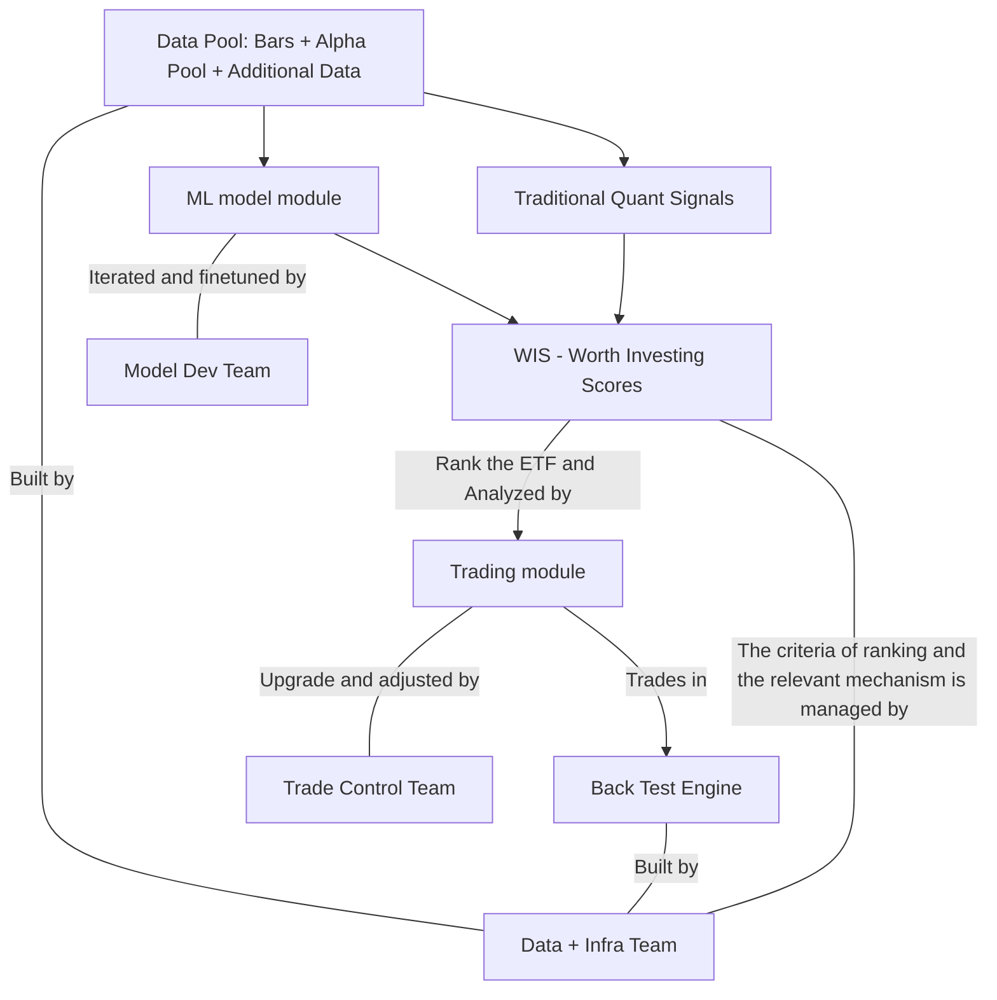

# ML based architecture

author: Simon

### A.The reason ML is introduced

1. **Faster and more powerful to select influential factors among large amount of factors.**

- No need to waste too much time on thinking how to compose new reasonable indexes.
- Don't have to try every combination of the indexes manually with a lot of scripts and lines of code.

1. It looks fancy to Sophiane and it's out of his knowledge scope.

- ML is the cutting edge topic in the field.
- ML is black box, instead of economic rationale, we focus on the performance.

1. It really learns something from the training dataset.

- Unsupervised method like baseline learns nothing from training dataset, which makes out-sample results outruns in-sample results.
- Unsupervised method like baseline needs a lot of tries to optimize the entire parameters to get a reasonable and sub-optimal outcome.

1. The project is more structured and easy to manage.

- We only need to iterate the weights and models to drive our strategy.

1. **Less code work**

- Compared to baseline model's heavy code. Several lines of code can train a powerful model.

### B.Architecture

#### **Requirement**

1. Good design on the whole pipeline - Once the model is developed, a small revision is required to upgrade the strategy.
2. Less redundant work for any group member.
3. A systematic infrastructure.

#### Illustration of the project and coworking




#### 1. Data Pool - Input of the model

1. The data (training and testing) is prepared by Data Infra Team. All the alphas and necessary indexes are computed in the dataset. The model team don't have to compose the alphas.
2. It's on weekly basis and exactly cooresponding to our weekly strategy.

#### 2. Worth Investing Score (WIS) - A composite signal for model prediction and historic evaluation

**The model has to fit the score**

1. The ETF is scored every week according to their performance in the future and in the past within the dataset.
2. Data Infra Team is working on how to compose the index.
3. There will be a lot versions of WIS.

#### Illustration of WIS signal

```mermaid
flowchart LR
    A[Traditional Quant Signals: Cumulative Return, Sharp Ratio] --> B[A certain algorithm]
    C[Multiple ML Model Siganls: Predict the Performance of the model from various alphas|bars] --> B
    B -->|compose| D[WSI for weekly ranking]
```


#### 3. FRS - Future Return Score (Traget Value for ML model)

#### 4. ML model module

1. Learn from the traning data pool.
2. Generate the FRS as accurate as possible.

#### 5. Trading  module

**The Data Infra Team will extract the parameters out for optimizing**

1. Rank the ETFs according to WIS.
2. Decide how to trade.
3. Avoid risks.
4. Reduce voltality.

### C. Short Strategy

1. Take the top last few ETFs from the ranking
2. Criteria: The momentum (culmulative return should be negative)

