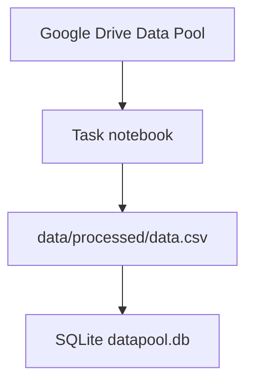
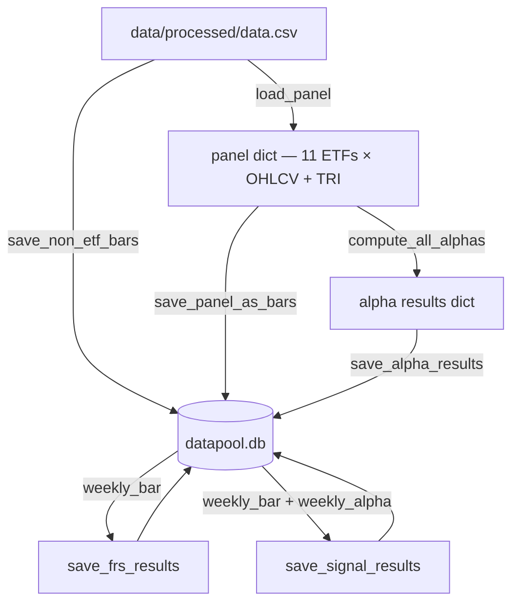

# Database — QuantLab Datapool

High-level reference for `datapool.db`: where data lives, how it flows into SQLite, what each table stores, and how to extend metrics.

Schema defined in `src/QuantLab/utils/db.py` (`init_db()`). Orchestration: `scripts/dataset_builder.ipynb`.

---

## Workflow



## Data Pipeline



---

## SQLite Schema

### `asset` — ticker master

| ticker | security_name | category |
|--------|---------------|----------|
| XLB … XLY (×11) | SPDR Sector ETF | ETF |
| SPY | SPY US Equity | Benchmark |
| SPX | SPX Index | Benchmark |
| VIX | VIX Index | Index |
| USGG10YR | USGG10YR Index | Index |

### `daily_bar` / `weekly_bar` — all 15 assets

| date | ticker | open | high | low | close | volume | tri |
|------|--------|------|------|-----|-------|--------|-----|

`weekly_bar` resampled to Wednesday close.

### `weekly_alpha` — ETF-only, long format

| date | ticker | alpha_id | value |

Full refresh on each `save_alpha_results` run.

### `weekly_frs` — ETF-only, long format

| date | ticker | frs_id | value |

Full refresh on each `save_frs_results` run.

### `weekly_signal` — ETF-only, long format

| date | ticker | signal_id | value |

Per-`signal_id` refresh: deletes then reinserts only the ids present in code. Removed ids persist until manually deleted.

### Registry tables (`alpha`, `frs`, `signal`)

Append-only for new ids. Existing rows are never deleted by `save_*` functions — clean up manually with SQL if needed.

---

## Asset Coverage

| Table | ETF (×11) | Benchmark (×2) | Index (×2) |
|-------|-----------|----------------|------------|
| daily_bar | ✓ | ✓ | ✓ |
| weekly_bar | ✓ | ✓ | ✓ |
| weekly_alpha | ✓ | — | — |
| weekly_frs | ✓ | — | — |
| weekly_signal | ✓ | — | — |

---

## Code Pointers

| Concern | Location |
|---------|----------|
| Schema + `init_db` | `src/QuantLab/utils/db.py` |
| Bars + panel load | `src/QuantLab/utils/data_loader.py` |
| Alpha compute / persist | `src/QuantLab/alpha/compute_alpha.py` |
| FRS compute / persist | `src/QuantLab/frs/compute_frs.py` |
| Signal compute / persist | `src/QuantLab/signal/compute_signal.py` |
| ML feature table | `src/QuantLab/utils/load_ml_input.py` |

---

## Developer Guide — Extending Metrics

### Update order (run in sequence)

1. Refresh bars if needed.
2. `compute_all_alphas` → `save_alpha_results` (if alphas changed).
3. `save_frs_results` (if FRS changed).
4. `save_signal_results` (if signals changed).
5. Manual `DELETE` for orphaned `weekly_signal` rows if a signal was removed.

### Write policies at a glance

| Step | Function | What changes |
|------|----------|--------------|
| Bars | `save_panel_as_bars`, `save_non_etf_bars` | `daily_bar`, `weekly_bar` (replace) |
| Alphas | `save_alpha_results` | `weekly_alpha`: full DELETE + insert; `alpha`: append new ids |
| FRS | `save_frs_results` | `weekly_frs`: full DELETE + insert; `frs`: append new ids |
| Signals | `save_signal_results` | `weekly_signal`: DELETE per signal_id + insert; `signal`: append new ids |

### Adding a metric

| Family | File | Decorator | Update DB |
|--------|------|-----------|-----------|
| FRS | `frs/frs_metrics.py` | `@register_frs("FRSn", ...)` | `save_frs_results(conn)` |
| Alpha | `alpha/alpha_metrics.py` | `@register_alpha(id=N, ...)` | `compute_all_alphas` → `save_alpha_results` |
| Signal non-ML | `signal/signal_metrics.py` | `@series_signal(...)` | `save_signal_results(conn)` |
| Signal ML | `signal/ml/<name>.py` | `@series_signal(...)` + `big: pd.DataFrame` first arg | `save_signal_results(conn)` |

### Code templates

**FRS** (`frs/frs_metrics.py`):
```python
@register_frs("FRS4", description="...", required_cols=["tri"])
def frs4(p: pd.Series, **kwargs) -> pd.Series:
    return (p.shift(-4) / p) - 1
```

**Alpha** (`alpha/alpha_metrics.py`):
```python
@register_alpha(id=102, group="custom", required=["close"], desc="...")
def alpha_102(panel: dict) -> pd.DataFrame:
    return panel["close"].rank(axis=1, pct=True)
```

**Signal non-ML** (`signal/signal_metrics.py`):
```python
@series_signal(signal_id=11, note="...", category="composite",
               required={"bars": ["tri", "close"], "alpha": [1]})
def sig_11(tri: pd.Series, close=None, alpha_1=None, **kwargs) -> pd.Series:
    return tri.pct_change(4)
```

**Signal ML** (`signal/ml/<name>.py`) — first arg must be `big: pd.DataFrame`, return `(ticker, date, pred)`:
```python
@series_signal(signal_id=9200, note="...", category="ML",
               required={"bars": ["tri"], "alpha": [1]})
def ml_9200(big: pd.DataFrame, **kwargs) -> pd.DataFrame:
    df = big[["date", "ticker", "tri"]].copy()
    df["pred"] = df.groupby("date")["tri"].rank(pct=True)
    return df[["ticker", "date", "pred"]]
```

### Removing a metric

Delete the decorated function, then clean up DB (child tables first):

```sql
DELETE FROM weekly_frs    WHERE frs_id    = ?;  DELETE FROM frs    WHERE frs_id    = ?;
DELETE FROM weekly_alpha  WHERE alpha_id  = ?;  DELETE FROM alpha  WHERE alpha_id  = ?;
DELETE FROM weekly_signal WHERE signal_id = ?;  DELETE FROM signal WHERE signal_id = ?;
```
