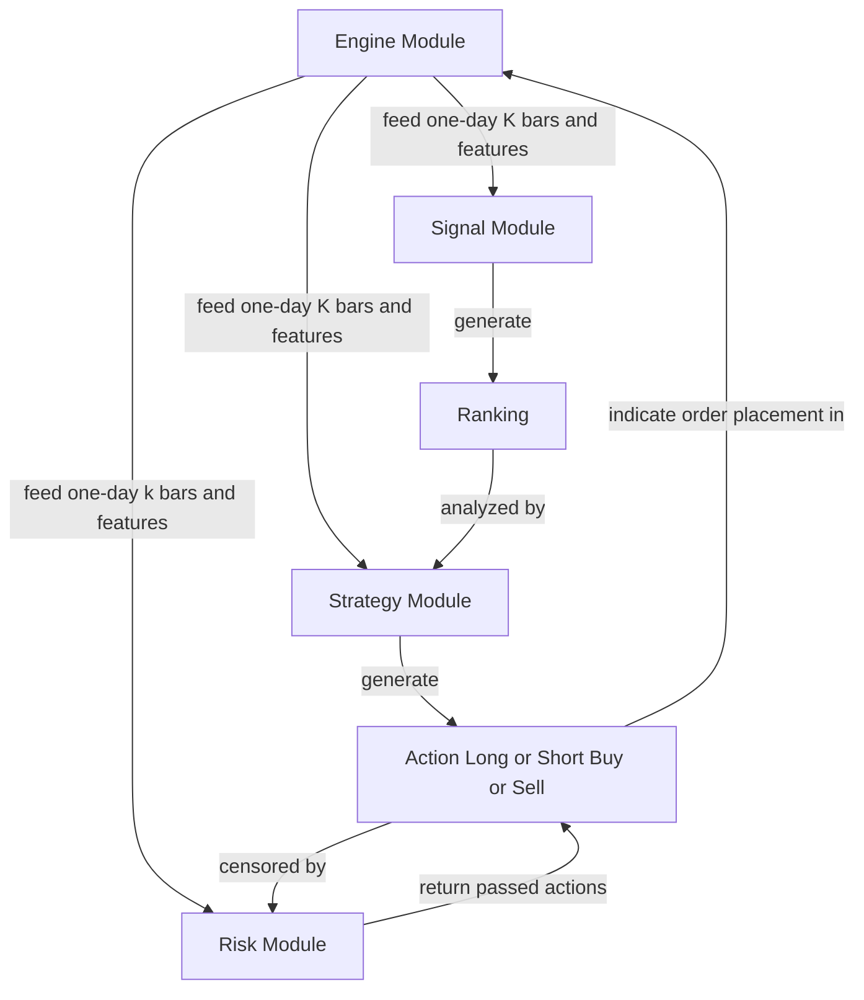

## Framework

```mermaid
flowchart TB
    
    eng[Engine Module] -->|feed one-day K bars and features| sgl[Signal  Module]
    eng -->|feed one-day K bars and features| stg[Strategy Module]
    eng -->|feed one-day k bars and features| rsk[Risk Module]
    sgl -->|generate| rnk[Ranking]
    rnk -->|analyzed by| stg
    stg -->|generate| act[Action Long or Short Buy or Sell]
    act -->|censored by| rsk
    rsk -->|return passed actions| act
    act -->|indicate order placement in| eng
```
    