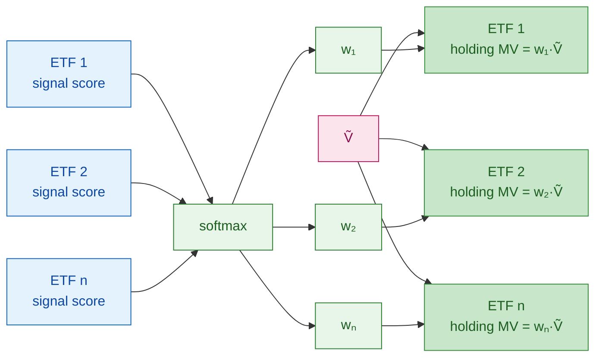
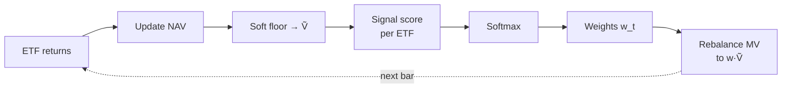

# Backtest Evaluation and Signal Optimization

**Code:** The strategy in §1–§2 lives in the strategy module as class **`SiganlOptimizationStrategy`** (long-only softmax allocator, soft floor, frictionless rebalance as specified below).

---

## 0. Equal-weight benchmark (baseline)

Before tuning any signal, establish a **frictionless equal-weight ETF baseline** as the mandatory floor for all Sharpe comparisons.

**Definition:** at every rebalance date, set $w_i = 1/N$ for all $N$ tradable ETFs. Equivalent to running `SiganlOptimizationStrategy` with a constant signal score for every ETF, since $\text{softmax}(c,\ldots,c) = [1/N,\ldots,1/N]$.

**Why equal-weight:** equal-weight is a strong null hypothesis for an ETF allocator — it is naive, cheap to implement, and empirically hard to beat on a risk-adjusted basis. A signal that cannot beat it adds no value.

**Implemented by:** `OptimizationTestSignal` (all scores = 1.0) + `SiganlOptimizationStrategy` in `backtests/signal_optimization/smoketest/`.

**Comparison table (report for every optimization run):**

| Metric | Equal-Weight (§0) | Strategy | Δ |
|--------|:-----------------:|:--------:|:-:|
| Sharpe Ratio | | | |
| Annual Return | | | |
| Annual Volatility | | | |
| Max Drawdown | | | |
| Turnover (ann.) | | | |

Use `QuantLab.backtest.benchmark.compare_metrics(baseline, candidate)` to populate this table.

---

## 1. Portfolio strategy

**Universe:** tradable **ETFs** at each rebalance date. **Long only.**

**Input:** one **signal score** per ETF, $s_i$ (higher → larger intended weight). No multi-signal mix inside this strategy class.

**Weights:** softmax over the ETF cross-section,

$$w_i = \frac{\exp(s_i)}{\sum_j \exp(s_j)}, \qquad w_i > 0,\ \sum_i w_i = 1.$$

**Dollar targets:** with deployable NAV $\tilde{V}$ after the soft floor (§2), target market value in ETF $i$ is $w_i \tilde{V}$.

**Orders:** let $\text{mv}_i$ be current MV in ETF $i$ before the trade; $d_i = w_i\tilde{V} - \text{mv}_i$. **Buy** if $d_i > 0$, **sell** if $d_i < 0$ (frictionless, fractional notionals). With **no fee**, trading only the $d_i$ is the same as **flatten to cash then reload** into the same softmax slices on $\tilde{V}$.

### Diagram: signal score → softmax → current holdings



### Wealth over time

Let $s_{t,i}$ be the signal score for ETF $i$ at $t$, $w_{t,i}$ the softmax weights, $V_t$ NAV after rebalance at $t$, $r_{t+1,i}$ simple return of ETF $i$ over $(t,t+1]$:

$$V_{t+1} = V_t \sum_i w_{t,i}(1 + r_{t+1,i}),$$

then rebalance to $w_{t+1}$ from the next signal scores.

### Period spine



---

## 2. Soft floor (numerical continuity)

To avoid zero or pathological negative notional when propagating the simulation (and to keep gradient-based paths defined when optimizing), apply a **soft floor** to the scalar used for sizing:

$$\tilde{V}_t = \max(V_t,\,\varepsilon), \quad \varepsilon = 10^{-6}$$

Implementation: **`cash = max(cash, eps)`** with **`eps = 1e-6`** when that variable is the deployable equity for sizing. **Document which variable is floored** so backtests and optimizers stay consistent.

**Semantics:** the floor is a **continuity device**, not an economic claim. Optionally log both raw $V_t$ and $\tilde{V}_t$ for reporting.

---

## 3. Backtest objective (evaluation score)

**Primary objective:**

$$\mathcal{L} = \text{Sharpe}(\text{portfolio})$$

Turnover is **not** part of the objective. In the Softmax long-only and short-only frameworks, turnover is a byproduct of signal volatility — penalising it would conflate signal quality with signal smoothness and distort the comparison. Turnover is reported as an informational metric only.

**Constraints and norms:**

- All runs use **zero fee, zero slippage** unless a friction sensitivity study is explicitly specified.
- Comparison is always relative to the **equal-weight baseline (§0)**. A run that does not beat §0 on Sharpe is treated as unsuccessful regardless of absolute value.

**Reported but not optimised:** turnover (ann.), max drawdown, CAPM alpha vs SPY, win rate.

---

## 4. Optimization (outside the strategy class)

`SiganlOptimizationStrategy` only consumes **one signal score vector per date** (per ETF). The three optimization **steps** below are all ways to produce or tune that vector (or its generator); each run is scored by §3 and compared to §0.

### Step 1 — Single signal, signal quality pre-screening

- **Scores:** one signal stream $g_{t,i}$ per ETF (or one family with **very few** knobs, e.g. lookback $d$).
- **Pre-screen before backtest:** compute **Information Coefficient (IC)** — the cross-sectional rank correlation between $g_{t,i}$ and forward 1-period return $r_{t+1,i}$ — over the in-sample window. Signals with mean IC < 0.02 or IC-IR (IC mean / IC std) < 0.3 are unlikely to survive the full backtest; prune early.
- **Tuning:** grid / manual sweep / small search on those knobs.
- **Role:** baseline and sanity check on the backtest shell and on Sharpe − turnover before heavier optimizers.

### Step 2 — Multiple signals, linear mix + Bayesian optimization

- **Scores:** $s_{t,i} = \sum_k \alpha_k \, g^{(k)}_{t,i}$ with fixed streams $g^{(k)}$ and weights $\alpha_k$ (constraints as needed for identifiability).
- **Tuning:** **Bayesian optimization** (TPE / GP) over $\{\alpha_k\}$ and other **low-dimensional** hyperparameters (e.g. lookback knobs). Typical search budget: 50–200 trials.
- **Regularization:** constrain $\sum_k |\alpha_k| \leq C$ or normalize $\alpha$ to the simplex to avoid degenerate single-signal solutions.
- **Validation:** use **walk-forward cross-validation** — train on rolling windows, evaluate on the following out-of-sample quarter. Report both in-sample and out-of-sample Sharpe to detect overfitting.
- **Role:** moderate dimension, expensive or noisy objective; **no** requirement for full end-to-end gradients through the simulator.

### Step 3 — Neural network wrapper

- **Scores:** a network outputs **logits per ETF** at each rebalance from features (and optional calendar inputs); logits are the **signal scores** fed into the same softmax → holdings path as §1.
- **Architecture choice:** start with a shallow MLP (2–3 layers) over lagged factor features; add attention or LSTM only if MLP IC is positive but insufficient.
- **Tuning:** **gradient-based** outer training when the unrolled backtest is differentiable (returns fixed w.r.t. net weights; soft floor as in §2). Avoid hard **argsort / top-k** in the allocation path — use softmax directly to preserve gradient flow.
- **Regularization:** L2 weight decay + dropout; clip gradient norm to 1.0. Monitor in-sample vs. out-of-sample Sharpe gap as the primary overfitting signal.
- **Role:** learn representations; backtest is the outer loss surface.

**Summary**

| Step | What is optimized | Typical method | Must beat | Objective |
|------|-------------------|----------------|-----------|-----------|
| 0 | — (equal weight, fixed) | — | — | Sharpe |
| 1 | Single signal (or tiny param set) | IC screen + grid sweep | Step 0 | Sharpe |
| 2 | Linear mix $\sum_k \alpha_k g^{(k)}$ + low-dim hyperparams | Bayesian optimization + walk-forward CV | Steps 0–1 | Sharpe |
| 3 | Network parameters $\theta$ producing per-ETF logits | SGD / Adam + differentiable backtest | Steps 0–2 | Sharpe |

---

## 5. Differentiability (brief)

**Step 3:** relevant when scores are **smooth in $\theta$** and the path stays **continuous** (soft floor, no hard sort / integer lots). **Steps 1–2:** usually treat the backtest as a **black box**.

---

## 6. Step 1 Backtest Results

Frictionless (zero fee, zero slippage). Universe: 11 SPDR sector ETFs.

### 6.0 Period Definition

| Period | Weekly bars | Purpose |
|--------|:-----------:|:--------|
| **In-sample (IS)** | 200 | Historical screening — signal selection basis |
| **Out-of-sample (OS)** | 61 (Jan 2025 – Mar 2026) | Forward validation — true performance |

### 6.1 Equal-Weight Baselines

| Mode | IS Sharpe | OS Sharpe |
|------|:---------:|:---------:|
| Long-only EW | 0.690 | 1.537 |
| Short-only EW | −0.690 | −1.537 |

IS covers a ~4-year mixed-regime period; OS captures the 2025–2026 bull run. All signal comparisons use the respective period's EW baseline.

### 6.2 ML Signal Screening

**Long Power (LP):**

| Signal | Val NDCG@3 | IS Sharpe | OS Sharpe | IS Δ vs EW | OS Δ vs EW |
|--------|:----------:|:---------:|:---------:|:----------:|:----------:|
| EqualWeight (§0) | — | 0.690 | 1.537 | — | — |
| LightGBM_frs3 | 0.639 | 0.691 | 1.534 | +0.001 | −0.003 |
| **Ensemble_RankAvg_frs1 ★** | 0.632 | 0.698 | **1.730** | +0.008 | **+0.193** |
| XGBoost_frs3 | 0.623 | 0.691 | 1.538 | +0.001 | +0.001 |
| PCA_Ridge_frs3 | 0.622 | 0.690 | 1.538 | 0.000 | +0.001 |
| MLP_frs2 | 0.596 | **0.705** | 1.598 | **+0.015** | +0.061 |

**Short Power (SP):**

| Signal | IS Sharpe | OS Sharpe | IS Δ vs EW | OS Δ vs EW |
|--------|:---------:|:---------:|:----------:|:----------:|
| EqualWeight (§0) | −0.690 | −1.537 | — | — |
| LightGBM_frs3 | −0.689 | −1.540 | +0.001 | −0.003 |
| **Ensemble_RankAvg_frs1 ★** | −0.692 | **−1.330** | −0.002 | **+0.207** |
| XGBoost_frs3 | −0.689 | −1.535 | +0.001 | +0.002 |
| PCA_Ridge_frs3 | −0.690 | −1.536 | 0.000 | +0.001 |
| MLP_frs2 | **−0.673** | −1.438 | **+0.017** | +0.099 |

IS best: **MLP_frs2** (LP and SP). OS best: **Ensemble_RankAvg_frs1** (LP +0.193, SP +0.207 vs EW). In-sample signals barely separated from EW; out-of-sample shows Ensemble holding a clear edge on both sides.

### 6.3 Alpha LP — Top 10

**In-sample (EW baseline = 0.690):**

| Rank | Alpha | IS Sharpe (LP) | Δ vs EW |
|------|-------|:--------------:|:-------:|
| 1 | **#24 ★** | **1.122** | +0.432 |
| 2 | #66 | 0.744 | +0.054 |
| 3 | #101 | 0.732 | +0.042 |
| 4 | #64 | 0.726 | +0.036 |
| 5 | #136 | 0.709 | +0.019 |
| 6 | #16 | 0.699 | +0.009 |
| 7 | #32 | 0.696 | +0.006 |
| 8 | #110 | 0.696 | +0.006 |
| 9 | #130 | 0.694 | +0.004 |
| 10 | #108 | 0.693 | +0.003 |

**Out-of-sample (EW baseline = 1.537):**

| Rank | Alpha | OS Sharpe (LP) | Δ vs EW |
|------|-------|:--------------:|:-------:|
| 1 | **#57 ★** | **2.174** | +0.637 |
| 2 | #24 | 2.055 | +0.518 |
| 3 | #19 | 2.014 | +0.477 |
| 4 | #31 | 1.854 | +0.317 |
| 5 | #23 | 1.829 | +0.292 |
| 6 | #22 | 1.750 | +0.213 |
| 7 | #64 | 1.747 | +0.210 |
| 8 | #37 | 1.717 | +0.180 |
| 9 | #10 | 1.667 | +0.130 |
| 10 | #18 | 1.658 | +0.121 |

### 6.4 Alpha SP — Top 10

**In-sample (EW-short baseline = −0.690):**

| Rank | Alpha | IS Sharpe (SP) | Δ vs EW |
|------|-------|:--------------:|:-------:|
| 1 | **#24 ★** | **−0.420** | +0.270 |
| 2 | #57 | −0.559 | +0.131 |
| 3 | #19 | −0.593 | +0.097 |
| 4 | #51 | −0.621 | +0.069 |
| 5 | #66 | −0.630 | +0.060 |
| 6 | #101 | −0.638 | +0.052 |
| 7 | #64 | −0.668 | +0.023 |
| 8 | #136 | −0.675 | +0.016 |
| 9 | #31 | −0.681 | +0.010 |
| 10 | #10 | −0.684 | +0.006 |

**Out-of-sample (EW-short baseline = −1.537):**

| Rank | Alpha | OS Sharpe (SP) | Δ vs EW |
|------|-------|:--------------:|:-------:|
| 1 | **#23 ★** | **−0.522** | +1.015 |
| 2 | #53 | −0.530 | +1.007 |
| 3 | #31 | −0.895 | +0.642 |
| 4 | #19 | −1.104 | +0.433 |
| 5 | #57 | −1.136 | +0.401 |
| 6 | #51 | −1.198 | +0.339 |
| 7 | #64 | −1.242 | +0.295 |
| 8 | #37 | −1.286 | +0.251 |
| 9 | #32 | −1.374 | +0.163 |
| 10 | #10 | −1.380 | +0.157 |

> Key finding: in-sample LP and SP were both dominated by **#24** (IS LP=1.122, IS SP=−0.420). Out-of-sample, #24 LP holds (2.055) but SP collapses (−2.339) — a textbook overfitting case on the short side. Forward validation is essential before deploying any signal in L/S.

### 6.5 Top Signal Profiles

**Long Power — Top 3** (ranked by OS LP)

**Alpha#57** (Group B — VWAP-based) · IS LP = 0.691 | OS LP = 2.174
$$\alpha_{57} = -\frac{c - \text{vwap}}{\text{decay\_linear}(\text{rank}(\text{ts\_argmax}(c, 30)),\ 2)}$$
Measures price deviation from VWAP, weighted by how recently the price peak occurred. ETFs trading below a recent-peak VWAP get a positive score (expected mean-reversion upward).

---

**Alpha#19** (Group A — WQ101) · IS LP = 0.564 | OS LP = 2.014
$$\alpha_{19} = -\text{sign}\bigl((c - \text{delay}(c,7)) + \Delta_{7}c\bigr) \times \bigl(1 + \text{rank}(1 + \sum_{250} r)\bigr)$$
Combines short-term momentum sign with a long-term cumulative-return rank. The sign inversion means it fades recent 7-day moves, scaled up for historically strong performers.

---

**Alpha#31** (Group A — WQ101) · IS LP = 0.683 | OS LP = 1.854
$$\alpha_{31} = \text{rank}^3\!\bigl(\text{decay}(-\text{rank}^2(\Delta_{10}c),\ 10)\bigr) + \text{rank}(-\Delta_3 c) + \text{sign}\!\bigl(\text{scale}(\text{corr}(\text{adv}_{20}, l, 12))\bigr)$$
Multi-component: (1) decayed rank of 10-day close momentum reversal, (2) 3-day close reversal rank, (3) sign of low/volume-flow correlation. Combines medium-term mean-reversion with liquidity-low correlation. Also a top-3 SP signal — the strongest all-around L/S candidate.

---

**Short Power — Top 3** (ranked by OS SP; higher = less negative = better)

**Alpha#23** (Group A — WQ101) · IS SP = −0.787 | OS SP = −0.522 (Δ +1.015 vs EW-short)
$$\alpha_{23} = \begin{cases} -\Delta_2 h & \text{if } \frac{1}{20}\sum_{20} h < h \\ 0 & \text{otherwise} \end{cases}$$
Only fires when the current high exceeds its 20-day moving average — i.e., at potential resistance. In that regime, fades the 2-day high move. Identifies ETFs that are extended and likely to pull back.

---

**Alpha#53** (Group A — WQ101) · IS SP = −0.977 | OS SP = −0.530 (Δ +1.007 vs EW-short)
$$\alpha_{53} = -\Delta_9\!\left(\frac{(c-l)-(h-c)}{c-l}\right)$$
Rate-of-change of the close position within the high-low range. A falling value (negative delta) signals the close is moving toward the low → bearish momentum. Note: IS SP = −0.977 (worse than EW); OS SP = −0.530 (best-2 across all alphas). Pure short signal — LP barely below EW in both periods.

---

**Alpha#31** (Group A — WQ101) · IS SP = −0.681 | OS SP = −0.895 (Δ +0.642 vs EW-short)
(Formula in LP section above.) Appears in both LP and SP top-3 — only alpha with strong out-of-sample performance on both sides.

---

## 7. Long Power / Short Power — Two-Way Signal Decomposition

### 7.1 Motivation

A signal that scores well in the long-only Softmax framework (Step 1) does **not** necessarily perform well in a long-short strategy. The two sides of a trade impose different demands:

- **Long side**: can the signal correctly rank the *top* ETFs (pick winners)?
- **Short side**: can the signal correctly rank the *bottom* ETFs (identify losers)?

A signal may have strong long-side predictive power but near-zero short-side power — making it valuable in a long-only allocation but harmful if used naively to drive short positions.

This decomposition is the direct diagnostic for the finding that **Alpha#19 (long-only Sharpe 1.968) produces negative Sharpe in the baseline L/S strategy** — it has high Long Power but insufficient Short Power.

### 7.2 Definitions

| Metric | Definition | Measured by |
|--------|-----------|-------------|
| **Long Power (LP)** | Sharpe of the signal run in `mode="long"` (softmax over raw scores, fully invested long) | `backtests/signal_optimization/long_only/` |
| **Short Power (SP)** | Sharpe of the signal run in `mode="short"` (softmax over *negated* scores, fully invested short) | `backtests/signal_optimization/short_only/` |

**Short-only mechanics**: `SiganlOptimizationStrategy(mode="short")` feeds `softmax(-s)` into the engine, so the ETFs with the *lowest* signal scores receive the *largest* short weights. A high SP means the signal reliably identifies underperformers.

**Baselines**:
- LP baseline: equal-weight long-only (constant score = 1) — same as Step 0.
- SP baseline: equal-weight short-only (constant score = 1, negated) — run separately via `smoketest` with `MODE="short"`.

### 7.3 Directory Layout

```
backtests/signal_optimization/
├── smoketest/          Equal-weight baseline (long or short, set MODE)
├── long_only/
│   ├── alphas/run.py   Long Power sweep — all alpha_ids
│   └── step1/run.py    Long Power sweep — ML signals 1–5
└── short_only/
    ├── alphas/run.py   Short Power sweep — all alpha_ids
    └── step1/run.py    Short Power sweep — ML signals 1–5
```

Each `run.py` follows the same structure as the original `alphas/run.py`: loop over signals, run `_run_one()` with the appropriate `mode`, write `alpha_comparison.md` and `alpha_summary.json`, re-run the best with full artifacts.

### 7.4 Combined Signal Quality Report

After running both sweeps, merge results using **OS** baselines (Jan 2025–Mar 2026): LP > 1.537 **and** SP > −1.537 qualify as L/S candidates.

**Alpha L/S candidates (OS LP > 1.537 and OS SP > −1.537):**

| Signal | OS LP | OS SP | Δ SP vs EW | Decision |
|--------|:-----:|:-----:|:----------:|:--------:|
| Alpha#57 | 2.174 | −1.136 | +0.401 | ✓ Strong |
| Alpha#19 | 2.014 | −1.104 | +0.433 | ✓ Strong |
| Alpha#31 | 1.854 | −0.895 | +0.642 | ✓ Strong |
| Alpha#23 | 1.829 | −0.522 | +1.015 | ✓ Strong |
| Alpha#22 | 1.750 | −1.426 | +0.111 | ✓ |
| Alpha#64 | 1.747 | −1.242 | +0.295 | ✓ |
| Alpha#37 | 1.717 | −1.286 | +0.251 | ✓ |
| Alpha#10 | 1.667 | −1.380 | +0.157 | ✓ |
| Alpha#18 | 1.658 | −1.382 | +0.155 | ✓ |
| Alpha#34 | 1.651 | −1.412 | +0.125 | ✓ |
| Alpha#32 | 1.640 | −1.374 | +0.163 | ✓ |
| Alpha#136 | 1.633 | −1.427 | +0.110 | ✓ |
| Alpha#135 | 1.626 | −1.417 | +0.120 | ✓ |
| Alpha#20 | 1.597 | −1.425 | +0.112 | ✓ |
| Alpha#30 | 1.564 | −1.507 | +0.030 | ✓ borderline |
| Alpha#54 | 1.548 | −1.527 | +0.010 | ✓ borderline |

**ML signals:**

| Signal | OS LP | OS SP | Δ SP vs EW | Decision |
|--------|:-----:|:-----:|:----------:|:--------:|
| Ensemble_RankAvg_frs1 | 1.730 | −1.330 | +0.207 | ✓ |
| MLP_frs2 | 1.598 | −1.438 | +0.099 | ✓ |
| XGBoost_frs3 | 1.538 | −1.535 | +0.002 | ✓ borderline |
| PCA_Ridge_frs3 | 1.538 | −1.536 | +0.001 | ✓ borderline |

**Special cases:**

| Signal | OS LP | OS SP | Note |
|--------|:-----:|:-----:|:-----|
| Alpha#24 | 2.055 | −2.339 | High LP but catastrophic SP → long-only only |
| Alpha#44 | 1.577 | −1.578 | LP above, SP just below threshold → L only |
| Alpha#16 | 1.557 | −1.571 | LP above, SP just below threshold → L only |
| Alpha#53 | 1.258 | **−0.530** | Best-2 OS SP but LP < EW → pure short signal |
| Alpha#51 | 1.259 | −1.198 | LP < EW, SP above threshold → pure short signal |
| LightGBM_frs3 | 1.534 | −1.540 | Both below EW baseline → discard |

**Decision rule**:
- LP > EW and SP > EW → L/S candidate (use in baseline strategy)
- LP > EW, SP ≤ EW → long-only signal only (exclude from short side)
- LP ≤ EW, SP > EW → pure short signal (can be used as inverted long signal)
- Both ≤ EW → discard

### 7.5 Integration with Optimization Steps

Long Power and Short Power are **pre-screening diagnostics** that run before (or alongside) the L/S baseline tests:

```
Step 1 (single signal)
  ├── Long-only Softmax  →  Long Power (LP)    ← long_only/
  ├── Short-only Softmax →  Short Power (SP)   ← short_only/
  └── Combined LP+SP → filter candidates for baseline L/S strategy

Step 2 (multi-signal blend)
  └── Blend only signals with LP > EW *and* SP > EW into L/S optimizer
      (avoids polluting the L/S weight mix with one-sided signals)
```

---

## 8. Complete Alpha LP/SP Reference Table

All 40 screened alphas. OS EW baselines: LP = 1.537, SP = −1.537. IS EW baselines: LP = 0.690, SP = −0.690. Sorted by OS LP descending.
"✓" = beats both OS baselines; "L" = long-only (OS LP > EW, OS SP ≤ EW); "S" = short-only (OS SP > EW, OS LP ≤ EW); "≈EW" = within rounding of EW; "—" = neither.

| Alpha | IS LP | IS SP | OS LP | OS SP | L/S status |
|-------|:-----:|:-----:|:-----:|:-----:|:----------:|
| #57  | 0.691 | −0.559 | 2.174 | −1.136 | ✓ |
| #24  | 1.122 | −0.420 | 2.055 | −2.339 | L only |
| #19  | 0.564 | −0.593 | 2.014 | −1.104 | ✓ |
| #31  | 0.683 | −0.681 | 1.854 | −0.895 | ✓ |
| #23  | 0.666 | −0.787 | 1.829 | −0.522 | ✓ |
| #22  | 0.675 | −0.751 | 1.750 | −1.426 | ✓ |
| #64  | 0.726 | −0.668 | 1.747 | −1.242 | ✓ |
| #37  | 0.676 | −0.709 | 1.717 | −1.286 | ✓ |
| #10  | 0.690 | −0.684 | 1.667 | −1.380 | ✓ |
| #18  | 0.645 | −0.718 | 1.658 | −1.382 | ✓ |
| #34  | 0.688 | −0.697 | 1.651 | −1.412 | ✓ |
| #32  | 0.696 | −0.693 | 1.640 | −1.374 | ✓ |
| #136 | 0.709 | −0.675 | 1.633 | −1.427 | ✓ |
| #135 | 0.685 | −0.698 | 1.626 | −1.417 | ✓ |
| #20  | 0.653 | −0.743 | 1.597 | −1.425 | ✓ |
| #44  | 0.527 | −0.868 | 1.577 | −1.578 | L only |
| #30  | 0.685 | −0.697 | 1.564 | −1.507 | ✓ |
| #16  | 0.699 | −0.692 | 1.557 | −1.571 | L only |
| #54  | 0.658 | −0.733 | 1.548 | −1.527 | ✓ |
| #123 | 0.690 | −0.690 | 1.537 | −1.537 | ≈EW |
| #116 | 0.690 | −0.690 | 1.537 | −1.537 | ≈EW |
| #118 | 0.690 | −0.691 | 1.536 | −1.538 | — |
| #110 | 0.696 | −0.685 | 1.534 | −1.540 | — |
| #66  | 0.744 | −0.630 | 1.532 | −1.475 | S only |
| #6   | 0.592 | −0.782 | 1.529 | −1.589 | — |
| #108 | 0.693 | −0.687 | 1.529 | −1.545 | — |
| #128 | 0.691 | −0.689 | 1.528 | −1.546 | — |
| #130 | 0.694 | −0.687 | 1.526 | −1.548 | — |
| #125 | 0.691 | −0.689 | 1.525 | −1.549 | — |
| #95  | 0.646 | −0.713 | 1.523 | −1.409 | S only |
| #83  | 0.169 | −0.689 | 1.518 | −1.925 | — |
| #61  | 0.552 | −0.809 | 1.517 | −1.494 | S only |
| #127 | 0.690 | −0.691 | 1.511 | −1.562 | — |
| #14  | 0.591 | −0.785 | 1.494 | −1.592 | — |
| #40  | 0.658 | −0.713 | 1.445 | −1.628 | — |
| #72  | 0.342 | −0.845 | 1.438 | −1.614 | — |
| #26  | 0.618 | −0.765 | 1.361 | −1.695 | — |
| #101 | 0.732 | −0.638 | 1.336 | −1.701 | — |
| #51  | 0.618 | −0.621 | 1.259 | −1.198 | S only |
| #53  | 0.559 | −0.977 | 1.258 | **−0.530** | S only |
