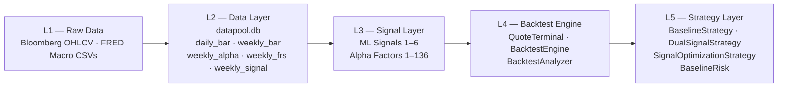
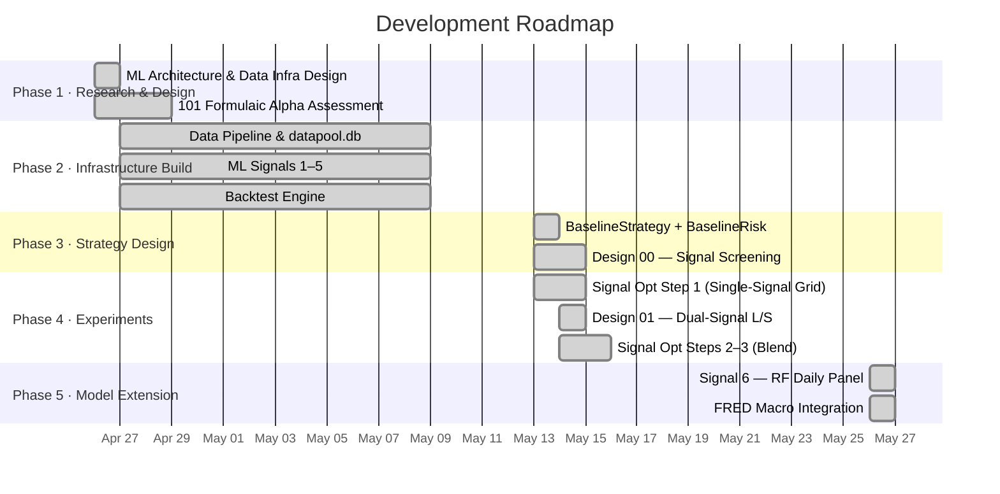
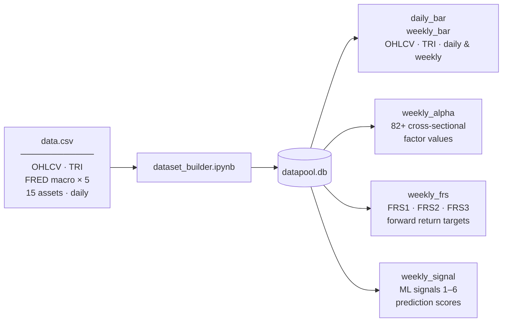
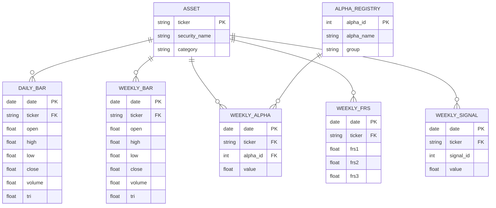
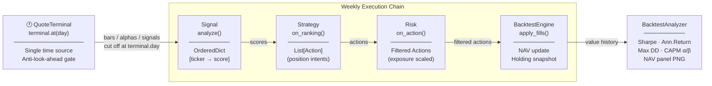
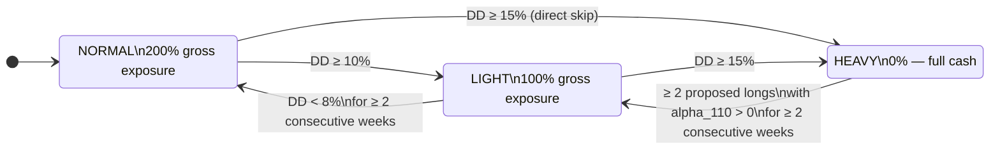
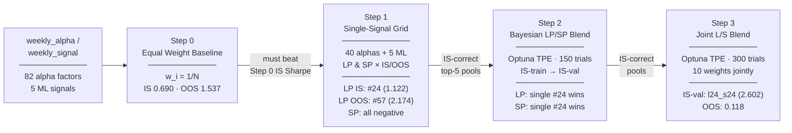

# ETF Rotation Investment Strategy Research — Project Progress Report

**Date**: June 1, 2026  
**Evaluation Window**: In-Sample 2021-03-03 → 2024-12-31 · Out-of-Sample 2025-01-01 → 2026-03-01  
**Universe**: 11 SPDR Sector ETFs

---

## Abstract

This report documents the research and development of a systematic quantitative framework for weekly sector ETF rotation. The project constructs a five-layer pipeline — from raw price data to a market-neutral long-short strategy — and evaluates a broad set of alpha signals and strategy configurations across in-sample and out-of-sample periods. A library of 82 implementable formulaic alpha factors is assembled and evaluated alongside six machine learning signals. A market-neutral long-short backtest engine is built with strict anti-look-ahead controls, and multiple strategy designs are tested, ranging from single-signal baseline selection to multi-signal Bayesian blending and joint optimisation. The report presents all experimental results in full, covering signal screening, strategy design, and portfolio-level performance across both evaluation periods.

---

## 1. Introduction

### 1.1 Objective

This project aims to construct a systematic, weekly-rebalanced investment strategy on the 11 SPDR Sector ETFs. Rather than relying on discretionary views of the economy, the project seeks to identify quantitative signals — derived from price data, factor formulas, and macroeconomic indicators — that produce consistent cross-sectional predictive power over forward sector returns. The strategy is designed to be market-neutral (net exposure approximately zero) by simultaneously holding long positions in the highest-ranked sectors and short positions in the lowest-ranked sectors.

### 1.2 Scope

The project was developed over approximately five weeks, from late April to late May 2026, by a nine-person team. Work on the research components documented here proceeded along two parallel tracks: **infrastructure and strategy design** (Simon) and **alpha factor research and machine learning modelling** (David). This report covers the full body of work completed to date, organised into the following components:

1. Data infrastructure and database design
2. Alpha factor library (formulaic and custom)
3. Machine learning signal construction
4. Backtest engine and execution framework
5. Strategy and risk module design
6. Empirical screening and strategy experiments

### 1.3 Evaluation Protocol

All experiments share a common IS/OOS split to prevent selection bias. The in-sample period (2021-03-03 to 2024-12-31, 200 weekly periods) is used for signal selection and strategy parameter decisions. The out-of-sample period (2025-01-01 to 2026-03-01, 61 weekly periods) is a held-out evaluation set that is reported after IS-based decisions are finalised. All backtests use zero transaction costs and zero slippage unless explicitly stated. Initial NAV is set to 10,000 for all runs.

---

## 2. Project Overview

### 2.1 System Architecture

The project is organised as a five-layer quantitative research stack. Data flows strictly upward from raw files through processing and signal generation to strategy execution; no layer has access to outputs from a higher layer.



*Figure 0. Five-layer system architecture. Each layer has a single well-defined responsibility; dependencies are strictly bottom-up.*

### 2.2 Development Roadmap

The project was executed over five weeks in two parallel research tracks. The timeline below shows the major milestones in the order they were completed.



*Figure 0b. Project development timeline. Phases 1–5 correspond to Sections 3–7 of this report.*

### 2.3 Key Design Decisions

Four conceptual choices shape the entire research programme. They are documented here because they recur across all subsequent experimental sections and motivate the structure of the evaluation.

**Market neutrality as the primary portfolio objective.** The strategy targets net exposure close to zero at all times by simultaneously holding long positions in the highest-ranked sectors and short positions in the lowest-ranked. This design removes broad market beta and isolates the purely cross-sectional component of the signal — the question being asked is not "will the market go up?" but "which sectors will outperform others?" Market neutrality also makes the strategy interpretable: a positive return in this framework is attributable to sector selection, not market timing.

**Absolute momentum as a gating condition for short entries.** US sector ETFs carry a structural long bias: over long horizons, all 11 sectors trend upward with the broad market. Shorting a sector that is in an upward 12-week trend, even if it ranks last cross-sectionally that week, tends to produce losses driven by the underlying market drift rather than genuine relative weakness. The strategy therefore gates short entries on negative 12-week absolute momentum, ensuring that short positions are opened only on sectors exhibiting both relative and absolute weakness.

**Equal weighting as the null hypothesis for signal evaluation.** Any signal that claims to rank sectors must first clear a basic bar: it must outperform a portfolio that ignores the signal entirely and weights all sectors equally. Equal weighting is therefore adopted as the mandatory Sharpe benchmark in all screening experiments. A signal that fails to beat this floor adds no cross-sectional information and is excluded from further consideration. This discipline prevents the project from pursuing signals that merely capture market beta rather than genuine sector-selection skill.

**Strict in-sample / out-of-sample separation.** All signal selection decisions, strategy configurations, and model hyperparameters are determined exclusively on the in-sample period (2021–2024). The out-of-sample period (2025–2026) is a fully held-out set, evaluated only once after IS-based decisions are finalised. Where IS-selected configurations underperform OOS, this is documented as an empirical finding, not treated as justification to revise the selection. This discipline prevents look-ahead bias in the research process itself and allows the OOS results to function as a genuine test of generalisability.

---

## 3. Data

### 3.1 Asset Universe

The tradable universe consists of 11 SPDR Select Sector ETFs, covering all major segments of the S&P 500: Materials (XLB), Communication Services (XLC), Energy (XLE), Financials (XLF), Industrials (XLI), Technology (XLK), Consumer Staples (XLP), Utilities (XLU), Health Care (XLV), Real Estate (XLRE), and Consumer Discretionary (XLY). Four additional non-tradable series are included as benchmark and feature inputs: SPY, SPX, VIX, and US10Y.

### 3.2 Data Pipeline and Database Design

The source dataset is `data.csv` — a 124-column flat file covering all 15 assets at daily frequency, with OHLCV, total return index, and five FRED macroeconomic series appended as additional columns. From this single file, the build pipeline populates all tables in `datapool.db`.



*Figure A. Data flow from `data.csv` to `datapool.db`. The build notebook is the sole write entry point; all strategy and signal modules read from the database only.*

The database schema follows a standard star design with `asset` as the dimension table and five fact tables keyed on `(date, ticker)`:

**Table 1. Database Schema**

| Table | Content | Frequency | Key Columns |
|-------|---------|-----------|-------------|
| `asset` | Ticker registry | Static | `ticker`, `category` |
| `daily_bar` | OHLCV + total return index | Daily | `open`, `high`, `low`, `close`, `volume`, `tri` |
| `weekly_bar` | Wednesday-close resample | Weekly | same as `daily_bar` |
| `weekly_alpha` | Factor values, ETFs only | Weekly | `alpha_id`, `value` |
| `weekly_frs` | Forward return scores, ETFs only | Weekly | `frs1`, `frs2`, `frs3` |
| `weekly_signal` | Signal scores, ETFs only | Weekly | `signal_id`, `value` |



*Figure B. Entity-relationship diagram of `datapool.db`. All fact tables reference `asset` via `ticker`; `weekly_alpha` additionally references `alpha_registry` via `alpha_id`.*

### 3.3 Forward Return Score (FRS) Targets

Three variants of the 4-week forward return score are defined, each capturing a different aspect of future performance:

**Table 2. Forward Return Score Definitions**

| Code | Name | Formula |
|------|------|---------|
| FRS1 | Total return | $(P_4 - P_0)\, /\, P_0$ |
| FRS2 | Sharpe proxy | $\bar{r}_{1\ldots4}\, /\, \sigma(r_{1\ldots4})$ |
| FRS3 | Vol-penalised return | $\text{FRS1} - 2.0 \times \sigma(r_{1\ldots4})$ |

FRS3 is the primary training target for most ML models, as it penalises volatile outperformance and rewards stable return profiles. FRS1 is used by the ensemble model (Signal 2) on the premise that raw return ranking may generalise more robustly across regimes.

### 3.4 Macroeconomic Data Integration

Five FRED macroeconomic series were appended to the data pipeline in the final phase of the project (May 26, 2026), extending the feature set for machine learning models and enabling macro-conditional signal construction:

**Table 3. FRED Macro Series**

| Ticker | Series | Economic Interpretation |
|--------|--------|------------------------|
| T10Y2Y | 10Y–2Y Treasury spread | Yield curve slope; recession signal |
| BAMLH0A0HYM2 | High-yield OAS | Credit risk appetite |
| DTWEXBGS | US Dollar broad index | Currency / risk-off environment |
| DCOILWTICO | WTI crude oil price | Energy and commodities cycle |
| T10YIE | 10-year breakeven inflation | Inflation expectations |

These series are stored as additional tickers in `daily_bar` and `weekly_bar`, and are accessible to all downstream signal and strategy modules through the standard `QuoteTerminal` interface.

---

## 4. Factor and Signal Construction

### 4.1 Formulaic Alpha Library (April 26, 2026)

The alpha library is based on the 101 formulaic alphas introduced by Kakushadze (2015), a widely cited collection of cross-sectional equity factor formulas. Each formula was assessed for implementability against the available dataset, and all viable alphas were coded, unit-tested, and evaluated on their information coefficient (IC) against forward returns.

**Implementability assessment.** Three data limitations constrain the full library:

1. **No industry neutralisation.** Seventeen alphas call for `IndNeutralize()`, which demeans a variable within an industry classification group. In a universe where each ETF *is* a sector, sub-industry demeaning is undefined and economically meaningless.
2. **No market capitalisation.** Two alphas require market-cap weighting, which is unavailable in the dataset.
3. **VWAP approximation.** Intraday tick data is not available; for 30 alphas, VWAP is approximated as the daily OHLC average: $\text{vwap} \approx (O + H + L + C)/4$.

**Table 4. Alpha Library Implementability Summary**

| Category | Count | Notes |
|----------|------:|-------|
| Group A — Fully implementable | 52 | All required fields available |
| Group B — VWAP approximated | 30 | $\text{vwap} \approx (O+H+L+C)/4$ |
| Not implementable | 19 | `IndNeutralize` or market-cap required |
| **Total** | **101** | |

All 82 implementable alphas were coded in `alphas/alpha_library.py` and validated by 270 unit tests (261 pass, 9 intentionally skipped). IC was computed against FRS1 on both train and test splits.

**Table 5. Top Alpha Factors by Mean IC (Train Split)**

| Alpha ID | Mean IC | Formula Description |
|----------|:-------:|---------------------|
| #50 | 0.042 | TS-max of ranked VWAP–volume correlation |
| #3 | 0.034 | Negative correlation of ranked open and ranked volume |
| #41 | 0.034 | Geometric mean of high–low minus VWAP |
| #24 | 0.033 | 100-day SMA trend deviation signal |
| #98 | 0.031 | Decay-linear VWAP–ADV correlation minus TS-argmin |

**Custom alpha extensions.** Twenty-nine custom alphas (alpha\_id 108–136) were added to supplement the formulaic library with momentum-based and technical signals. Among these, `alpha_110` — the 12-week cumulative return — occupies a special role: it is used exclusively as a **short-entry momentum filter** within the risk module (see Section 5.1) and is never included in the cross-sectional ranking signal.

### 4.2 Machine Learning Signals 1–5

Five machine learning models were trained on the weekly alpha-and-bar panel to predict FRS targets, and their predictions were stored in `weekly_signal` as signal\_id 1 through 5. Each model outputs a per-ETF score each week; higher scores indicate stronger predicted forward performance.

**Table 6. ML Signal Pool (Signals 1–5)**

| signal\_id | Model | Training Target | Notes |
|-----------|-------|----------------|-------|
| 1 | LightGBM | FRS3 | Gradient-boosted trees |
| 2 | Ensemble (Rank Average) | FRS1 | Average rank of multiple model outputs |
| 3 | XGBoost | FRS3 | Gradient-boosted trees, alternative library |
| 4 | PCA + Ridge | FRS3 | Dimensionality reduction + linear model |
| 5 | MLP | FRS2 | Multi-layer perceptron |

The ensemble model (Signal 2) averages the cross-sectional ranks from multiple constituent models rather than averaging raw predictions, making it robust to outlier scores. FRS1 was selected as its target on the premise that raw return ranking is less sensitive to volatility estimation errors than FRS3.

### 4.3 Signal 6 — Random Forest Daily Panel Model (May 26, 2026)

Signal 6 was developed by David as a theory-informed redesign of the ML modelling approach, moving from a weekly alpha panel to a **daily panel with economically motivated features**. The model predicts `frs_4`, defined as the 5-trading-day forward excess return over SPY:

$$\text{frs\_4} = \left(\frac{P_i[t+5d]}{P_i[t]} - 1\right) - \left(\frac{P_\text{SPY}[t+5d]}{P_\text{SPY}[t]} - 1\right)$$

**Feature engineering.** The model uses 57 features, divided into two groups:

*Cross-sectional price and volume features (10 base, per-date winsorised at 5/95th percentiles, then z-scored):*

| Feature | Definition |
|---------|-----------|
| `f_ret_1w`, `f_ret_4w`, `f_ret_12w` | 1-, 4-, 12-week returns |
| `f_mom_12_1` | Jegadeesh–Titman momentum: close[t−1w] / close[t−12w] − 1 |
| `f_vol_12w` | 12-week realised volatility |
| `f_dd_52w` | Distance from 52-week high: close / rolling max − 1 |
| `f_rs_spy_12w` | Relative strength vs SPY over 12 weeks |
| `f_beta_spy_26w` | 26-week rolling beta to SPY |
| `f_dvol_log_z12w` | Dollar volume z-score (12-week) |
| `f_ma_dist_12w` | Distance from 12-week moving average |

*Macro-sector interaction features (4, kept raw — not cross-sectionally z-scored):*

| Feature | Definition |
|---------|-----------|
| `m_defensive_x_VIXz` | Defensive sectors (XLP, XLU, XLV) × VIX z-score |
| `m_cyclical_x_VIXz` | Cyclical sectors (XLY, XLI, XLB) × VIX z-score |
| `m_ratesens_x_dUS10Yz` | Rate-sensitive sectors (XLF, XLRE, XLU) × ΔUS10Y z-score |
| `m_techgrowth_x_dUS10Yz` | Tech/growth sectors (XLK, XLC) × ΔUS10Y z-score |

These macro interaction terms encode the expected differential sensitivity of sector returns to the volatility and rate regime — for example, defensive sectors should outperform cyclicals when VIX rises, and rate-sensitive sectors should underperform when yields rise steeply.

**Model and walk-forward methodology.** A single `RandomForest` is trained on a pooled panel of all 11 sectors. An expanding-window quarterly refit scheme is used, with initial training ending 2023-06-30. Inner hyperparameter tuning uses `PurgedTimeSeriesSplit(n_splits=3, gap=5)` scored by mean weekly Spearman IC, over a grid of `max_depth ∈ {4, 6, 8}` × `min_samples_leaf ∈ {100, 200, 400}`. Per-ticker mean excess return is subtracted before fitting to remove sector fixed effects.

**Table 7. Signal 6 Out-of-Sample Performance (2023-07-03 → 2026-03-12, 138 weekly periods)**

| Metric | Value |
|--------|-------|
| Weekly Spearman IC (mean) | 0.033 |
| IC standard deviation | 0.425 |
| IC-IR | 0.077 |
| IC 95% CI (block bootstrap) | [−0.042, +0.096] |
| NDCG@3 | 0.143 |
| Top-3 precision | 32.9% |
| Hit rate | 54.6% |
| Daily R² | −0.029 |

The weekly IC of 0.033 is modest but positive. However, the 95% bootstrap confidence interval spans zero, indicating the result is statistically insignificant at current sample sizes. More critically, the daily-cadence directional prediction is inverse: the correlation between predictions and realised returns is −0.069 at the daily level, suggesting the forward-fill aggregation to weekly cadence masks a directional reversal. Several methodological issues were identified during evaluation:

**Table 8. Known Methodological Issues — Signal 6**

| Issue | Severity |
|-------|:--------:|
| Inner CV purge gap too small: `gap=5` rows ≈ 0.45 days; 5-day overlapping labels require `gap ≥ 55` rows | High |
| Daily directional prediction is inverse: `corr(pred, y_true) = −0.069` | High |
| IC 95% CI includes zero — statistically insignificant over 138 periods | Medium |
| Sector fixed effects computed before inner CV splits introduce mild look-ahead | Medium |

Despite these limitations, Signal 6 was integrated into the `weekly_signal` table as `signal_id = 6` via `signal_6.py`, which pivots the daily predictions to wide format and forward-fills onto the Wednesday calendar. A Baseline L/S portfolio backtest for Signal 6 has not yet been conducted.

---

## 5. Backtest Framework

### 5.1 System Architecture

The backtest engine is structured as a five-layer stack with strict unidirectional data flow:

```
┌──────────────────────────────────────────────────────────────────┐
│ L5  Strategy Layer                                               │
│     Baseline L/S  ·  Dual-Signal L/S  ·  Signal Optimization    │
├──────────────────────────────────────────────────────────────────┤
│ L4  Backtest Engine                                              │
│     BacktestEngine · QuoteTerminal · BacktestAnalyzer            │
├──────────────────────────────────────────────────────────────────┤
│ L3  Signal Layer                                                 │
│     ML signals (signal_id 1–6)  ·  Alpha factors (id 1–136)     │
├──────────────────────────────────────────────────────────────────┤
│ L2  Data Layer                                                   │
│     datapool.db: daily_bar · weekly_bar · weekly_alpha · weekly_signal │
├──────────────────────────────────────────────────────────────────┤
│ L1  Raw Data                                                     │
│     data/processed/data.csv  +  FRED macro CSVs                 │
└──────────────────────────────────────────────────────────────────┘
```

The engine is decomposed into four modules with clearly separated responsibilities:

**Table 9. Backtest Engine Module Responsibilities**

| Module | Responsibility | Key Interface |
|--------|---------------|---------------|
| `QuoteTerminal` | Single source of truth for time and market data | `terminal.at(day)`, `terminal.signals()`, `terminal.alphas()` |
| `BacktestEngine` | Advances simulation clock, applies fills, coordinates modules | `engine.run()`, `engine.evaluate()` |
| `Signal / Strategy / Risk` | Score generation → position intent → risk-filtered actions | `signal.analyze()`, `strategy.on_ranking()`, `risk.on_action()` |
| `BacktestAnalyzer` | Performance metrics computation and visualisation | `analyzer.report()` → JSON, Markdown, CSV, PNG |

The critical design invariant is that **all historical data queries are filtered at `terminal.day`** — no module can access data beyond the current simulation date. Signal, Strategy, and Risk modules all receive the same terminal instance via `bind(terminal)`, ensuring a single consistent time boundary across the entire execution chain.



*Figure C. Weekly execution chain within the backtest engine. `QuoteTerminal` acts as a shared, time-bounded data gate for all modules.*

### 5.2 Execution Convention and Anti-Look-Ahead Protocol

A key source of look-ahead bias in weekly strategies arises from using the same bar's closing price both to compute the signal and to execute the trade. The framework eliminates this by separating signal observation from execution:

- **Signal observation**: Wednesday close — all factor scores and ML predictions are computed using data up to and including Wednesday's close.
- **Trade execution**: Thursday close — all rebalancing trades are filled at the following day's close.

This one-day lag compresses the weekend gap to a single overnight hold and prevents any direct contamination of signal scores by execution prices.

### 5.3 Performance Metrics and Output Artefacts

Each backtest run produces a standardised set of output artefacts:

**Table 10. Standard Output Artefacts per Backtest Run**

| File | Content |
|------|---------|
| `*_metrics.json` / `*_metrics.md` | Sharpe ratio, annualised return, annualised volatility, maximum drawdown, win rate, CAPM α and β, annualised turnover |
| `*_value_history.csv` | Weekly NAV time series |
| `*_holding_history.csv` | Weekly position snapshots |
| `*_all_in_one_panel.png` | Multi-panel dashboard: NAV vs SPY, drawdown, rolling Sharpe, position heatmap |

All performance metrics are computed on a weekly-return series. The Sharpe ratio is annualised assuming 52 trading weeks. CAPM alpha and beta are estimated by regressing weekly strategy excess returns on SPY excess returns over the full backtest window.

---

## 6. Strategy Design

### 6.1 Market-Neutral Long-Short Strategy (BaselineStrategy)

The core strategy is a market-neutral long-short sector rotation portfolio, rebalancing weekly on the 11-ETF universe. At each rebalance, the strategy receives an ordered ranking of ETFs from the signal module and constructs a portfolio that is long the top-ranked sectors and short the bottom-ranked sectors.

**Position structure.** Under normal conditions, the strategy holds three long and three short positions, each at ±33.3% of NAV:

**Table 11. Position Structure by Risk State**

| Risk State | Long Exposure | Short Exposure | Gross Exposure | Net Exposure |
|-----------|:-------------:|:--------------:|:--------------:|:------------:|
| NORMAL | +100% | −100% | 200% | ~0% |
| LIGHT | +50% | −50% | 100% | ~0% |
| HEAVY | 0% | 0% | 0% (cash) | 0% |

**Short-entry filter.** A short position is only opened if the candidate ETF's `alpha_110` (12-week cumulative return) is negative. This momentum gate prevents the strategy from shorting sectors in upward trends, where short positions would carry negative expected return. If fewer than three candidate ETFs satisfy this condition, the short book is proportionally smaller; the unfilled slots are left vacant rather than replaced.

**Rank stickiness.** To reduce unnecessary turnover from minor rank fluctuations, existing holdings are retained if the ETF's current rank falls within a tolerance band around the selection boundary: within rank `n_long + 2` for long positions (default: rank ≤ 5) and within `n_total − n_short − 1` for short positions (default: rank ≥ 7, for an 11-ETF universe). A short position is force-closed immediately if its `alpha_110` turns positive, regardless of stickiness.

### 6.2 Drawdown Risk Management (BaselineRisk)

The risk module implements a three-state exposure control machine based on portfolio drawdown from the running peak NAV:



*Figure D. `BaselineRisk` three-state drawdown machine. Transitions to reduced exposure are triggered immediately; recovery requires the condition to hold for at least two consecutive weeks.*

**Table 12. BaselineRisk Parameters**

| Parameter | Default | Description |
|-----------|:-------:|-------------|
| `dd_light` | 10% | NORMAL → LIGHT transition threshold |
| `dd_heavy` | 15% | LIGHT → HEAVY transition threshold |
| `dd_recovery` | 8% | Recovery threshold for LIGHT → NORMAL |
| `recovery_weeks` | 2 | Consecutive weeks required to confirm recovery |
| `heavy_recovery_min_pos` | 2 | Minimum positive-momentum long candidates for HEAVY → LIGHT |

If drawdown jumps directly from below `dd_light` to above `dd_heavy` in a single week, the machine transitions to HEAVY immediately, bypassing the LIGHT state. Recovery conditions must be satisfied for at least two consecutive weeks; any interruption resets the counter to zero.

### 6.3 Signal Optimization Framework

Alongside the market-neutral baseline, a separate **signal optimization** track evaluates signals under a softmax allocation strategy. Rather than selecting a fixed number of positions, signal scores are mapped to portfolio weights via the softmax function:

$$w_i = \frac{\exp(s_i)}{\sum_{j=1}^{N} \exp(s_j)}$$

Two allocation modes are defined:

- **Long Power (LP):** softmax applied to raw scores produces a fully-invested long-only portfolio. Higher-scoring ETFs receive larger weights.
- **Short Power (SP):** softmax applied to *negated* scores produces a fully-invested short-only portfolio. Lower-scoring ETFs receive larger short weights.

The equal-weight portfolio — obtained when all scores are equal — serves as a mandatory baseline (Step 0): a signal must produce a higher IS Sharpe than equal-weight to be considered informative. This floor ensures that only signals with genuine cross-sectional discriminating power advance to subsequent optimisation steps.

The optimisation proceeds across four steps of increasing complexity:

**Table 13. Signal Optimization Steps**

| Step | What Is Optimised | Method | Must Beat |
|------|-------------------|--------|-----------|
| 0 | — (equal weight) | — | — |
| 1 | Single signal stream | IC pre-screen + full grid | Step 0 (EW) |
| 2 | Linear blend $\sum_k \alpha_k g^{(k)}$ | Bayesian optimisation (Optuna TPE) | Step 1 |
| 3 | Joint L/S blend (10 weights) | Bayesian optimisation on full L/S Sharpe | Steps 0–2 |



*Figure E. Signal optimization pipeline (Steps 0–3). Each step uses only IS data for selection; OOS is reported as a holdout validation.*

---

## 7. Empirical Results

### 7.1 Baseline L/S — Alpha Factor Screening (Design 00)

Forty alpha factor IDs spanning Group A and Group B were evaluated through the full `BaselineStrategy` + `BaselineRisk` pipeline. Tables 14 and 15 report the complete IS and OOS results.

**Table 14. Baseline L/S — Alpha Screening, In-Sample (2021-03-03 → 2024-12-31)**

| alpha\_id | Sharpe | Ann. Return | Ann. Vol | Max DD | Turnover |
|-----------|:------:|:-----------:|:--------:|:------:|:--------:|
| **#66 ★** | **0.967** | **8.90%** | 9.26% | −12.83% | 4535% |
| #101 | 0.923 | 10.37% | 11.39% | −17.27% | 3134% |
| #128 | 0.609 | 6.60% | 11.60% | −13.89% | 3151% |
| #32 | 0.684 | 7.43% | 11.44% | −13.05% | 2833% |
| #57 | 0.352 | 2.44% | 7.67% | −15.68% | 2124% |
| #127 | 0.368 | 3.16% | 9.73% | −16.04% | 1320% |
| #23 | 0.432 | 3.08% | 7.73% | −17.81% | 1834% |
| #30 | 0.411 | 2.91% | 7.71% | −15.34% | 2057% |
| #16 | 0.298 | 2.17% | 8.37% | −16.37% | 1717% |
| #64 | 0.290 | 2.33% | 9.53% | −16.83% | 1753% |

**Table 15. Baseline L/S — Alpha Screening, Out-of-Sample (2025-01-01 → 2026-03-01)**

| alpha\_id | Sharpe | Ann. Return | Ann. Vol | Max DD | Turnover |
|-----------|:------:|:-----------:|:--------:|:------:|:--------:|
| **#23 ★** | **1.819** | **19.34%** | 10.00% | −6.47% | 4787% |
| #51 | 1.478 | 15.09% | 9.84% | −5.84% | 4305% |
| #37 | 1.463 | 16.38% | 10.77% | −5.78% | 3923% |
| #57 | 1.315 | 14.40% | 10.67% | −7.40% | 5425% |
| #10 | 1.090 | 11.58% | 10.57% | −6.90% | 4976% |
| #16 | 1.019 | 9.29% | 9.13% | −6.35% | 4118% |
| #83 | 0.942 | 9.97% | 10.68% | −6.92% | 5407% |
| #135 | 0.805 | 8.93% | 11.43% | −11.10% | 2696% |
| #22 | 0.644 | 5.79% | 9.43% | −6.51% | 6414% |
| **#66** | −0.483 | −5.25% | 10.11% | −9.27% | 4542% |

The IS best-performing signal, Alpha#66 (IS Sharpe 0.967, Ann. Return 8.90%, CAPM α 7.37%, β 0.119), does not appear among the OOS top performers, registering a Sharpe of −0.483 in the OOS period.


*Figure 1. NAV panel for the IS-best alpha signal (Alpha#66) under the Baseline L/S strategy. In-sample period 2021-03-03 → 2024-12-31.*

The OOS best-performing signal is Alpha#23 (Sharpe 1.819, Ann. Return 19.34%, Max DD −6.47%, CAPM α 14.71%, β 0.227), a high-breakout momentum reversal factor based on the 20-day high relative to current high.


*Figure 2. NAV panel for the OOS-best alpha signal (Alpha#23) under the Baseline L/S strategy. Out-of-sample period 2025-01-01 → 2026-03-01.*

### 7.2 Baseline L/S — ML Signal Screening (Design 00)

All five ML signals (signal\_id 1–5) were evaluated through the same Baseline L/S pipeline.

**Table 16. Baseline L/S — ML Signal Screening Results**

| Signal | IS Sharpe | IS Ann. Return | IS Max DD | OOS Sharpe | OOS Ann. Return | OOS Max DD |
|--------|:---------:|:--------------:|:---------:|:----------:|:---------------:|:----------:|
| 1 — LightGBM\_frs3 | **0.601** | 5.09% | −13.71% | −1.571 | −8.54% | −11.76% |
| 2 — Ensemble\_RankAvg\_frs1 | 0.330 | 2.17% | −16.72% | **0.862** | 10.24% | −4.59% |
| 3 — XGBoost\_frs3 | 0.560 | 4.65% | −16.47% | −0.731 | −4.79% | −10.33% |
| 4 — PCA\_Ridge\_frs3 | 0.442 | 3.89% | −18.05% | 0.267 | 2.47% | −7.98% |
| 5 — MLP\_frs2 | 0.247 | 1.61% | −7.66% | −0.087 | −1.27% | −10.40% |

The IS-best signal, LightGBM\_frs3 (Signal 1), produces a Sharpe of −1.571 in the OOS period. The rank-average ensemble (Signal 2), which targets FRS1 rather than the vol-penalised FRS3, is the only ML signal to remain positive in both splits — IS Sharpe 0.330, OOS Sharpe 0.862. The three FRS3-targeting single models (Signals 1, 3, 4) all degrade substantially out-of-sample, suggesting that the vol-penalisation in the training target introduces regime-specific characteristics that do not persist into 2025–2026.

### 7.3 Signal Optimization — Step 1: Single-Signal Screening

Step 1 evaluates each candidate signal under the softmax allocation framework (LP and SP modes) across IS and OOS. The equal-weight Step 0 baseline registers IS Sharpe 0.690 and OOS Sharpe 1.537, serving as the minimum bar for all Step 1 candidates.

**Table 17. Signal Optimization Step 1 — Best Results by Mode and Split**

| Mode | Split | Best | Sharpe | Ann. Return |
|------|-------|------|:------:|:-----------:|
| LP (long-only) | IS | Alpha #24 | 1.122 | 21.38% |
| LP (long-only) | OOS | Alpha #57 | 2.174 | 30.06% |
| SP (short-only) | IS | Alpha #24 | −0.420 | −7.35% |
| SP (short-only) | OOS | Alpha #23 | −0.522 | −6.76% |
| ML — LP | IS | Signal 5 (MLP) | 0.705 | 9.98% |
| ML — LP | OOS | Signal 2 (Ensemble) | 1.730 | 19.12% |
| ML — SP | IS | Signal 5 (MLP) | −0.673 | −10.75% |
| ML — SP | OOS | Signal 2 (Ensemble) | −1.330 | −13.06% |

The SP mode is structurally unprofitable across all candidates and both splits — every SP Sharpe is negative. A pure short-only portfolio on US sector ETFs is loss-making in this sample, as the long-run upward drift of equity markets means that indiscriminate short selling generates negative expected return. The SP track is consequently deprioritised in subsequent strategy designs.


*Figure 3. NAV panel for the OOS-best LP signal (Alpha#24) under the Signal-Opt long-only framework. Out-of-sample period 2025-01-01 → 2026-03-01.*

### 7.4 Design 01 — Dual-Signal Asymmetric Long/Short

Design 01 tests whether assigning **different alpha signals to the long and short legs** of a market-neutral portfolio produces better IS performance than the symmetric baseline. The motivation is that Step 1 reveals Alpha#24 to be the dominant IS LP signal, but LP and SP rankings do not need to coincide — a signal that ranks the best sectors well need not also rank the worst sectors well.

**Experimental grid.** A 4×5 grid of long–short alpha pairs was evaluated:

- Long candidates: Alpha#24, #66, #101, #64
- Short candidates: Alpha#24, #57, #19, #51, #66

This yields 20 unique pairs, all evaluated under `DualSignalStrategy` + `BaselineRisk`, with zero transaction costs.

**Table 18. Design 01 — Selected IS and OOS Results**

| Pair | IS Sharpe | IS Ann. Return | OOS Sharpe | OOS Ann. Return | OOS Max DD |
|:----:|:---------:|:--------------:|:----------:|:---------------:|:----------:|
| `l24_s66` ★ IS | **1.236** | 15.72% | −0.853 | −7.52% | −11.18% |
| `l66_s24` | 1.117 | 14.09% | **0.965** | 10.89% | −6.19% |
| `l66_s57` | 0.652 | 8.12% | 0.652 | 7.70% | −6.01% |
| `l24_s24` | 0.213 | 1.48% | −0.011 | −0.49% | −9.92% |
| `l66_s66` | 0.816 | 8.33% | 0.308 | 3.29% | −8.17% |

The IS-selected pair `l24_s66` achieves an IS Sharpe of 1.236 — the highest in the grid — but collapses to −0.853 in the OOS period (rank 18 out of 20 pairs). Conversely, the pair `l66_s24` — the same two alphas with the long and short sides reversed — produces an OOS Sharpe of 0.965, yet was not IS-selected (IS rank 6).

This reversal pattern, in which all five `l66_*` pairs perform positively OOS while all five `l24_*` pairs underperform, indicates that the IS alpha rankings for Alpha#24 and Alpha#66 exchange roles in the OOS regime.

Transaction costs were also evaluated for selected pairs. Applying a round-trip cost of approximately 2 bps per leg reduces OOS Sharpe by roughly 0.1–0.2 for the best-performing configurations, leaving the qualitative conclusions unchanged.


*Figure 4. NAV panel for the IS-selected Design 01 pair (l24\_s66). In-sample period 2021-03-03 → 2024-12-31.*


*Figure 5. NAV panel for the OOS-best Design 01 pair (l66\_s24). Out-of-sample period 2025-01-01 → 2026-03-01.*

### 7.5 Signal Optimization — Steps 2 and 3: Multi-Signal Blending

Steps 2 and 3 attempt to improve on the single-signal Step 1 baseline by combining multiple alpha signals through optimised blending weights.

**Step 2 — Bayesian LP/SP Blend.** Using IS-correct candidate pools derived from the Step 1 IS rankings — LP pool: {#24, #66, #101, #64, #136}; SP pool: {#24, #57, #19, #51, #66} — a Bayesian optimiser (Optuna TPE, 150 trials) searches for blend weights that maximise IS-validation Sharpe over the period 2024-01-01 to 2024-12-31.

**Table 19. Signal Optimization Step 2 — LP and SP Blend Results**

| Configuration | IS-train | IS-val Sharpe | OOS Sharpe |
|--------------|:--------:|:-------------:|:----------:|
| **Single #24 — LP (IS-selected)** | — | **2.176** | **1.935** |
| LP blend (#24 55%, #66 30%, #101 8%, #136 7%) | 0.871 | 2.006 | 1.877 |
| Equal-weight LP blend | — | 1.744 | 1.851 |
| **Single #24 — SP (IS-selected)** | — | **−0.647** | −0.704 |
| SP blend (#66 51%, #19 24%, #51 15%, #57 11%) | −1.307 | −1.605 | −0.886 |

Single Alpha#24 wins the IS-validation comparison for both LP and SP, meaning the blending step adds no benefit over the dominant single-signal candidate in this universe.


*Figure 6. NAV panel for the IS-selected Step 2 LP configuration (single Alpha#24). Out-of-sample period 2025-01-01 → 2026-03-01. OOS Sharpe: 1.935.*

**Step 3 — Joint L/S Blend.** Because LP/SP-side optimisation in isolation does not account for interactions within the full market-neutral strategy, Step 3 optimises all 10 blend weights (5 LP + 5 SP) simultaneously, using the full L/S Sharpe of `DualSignalStrategy` + `BaselineRisk` as the objective (Optuna TPE, 300 trials).

**Table 20. Signal Optimization Step 3 — Joint L/S Blend Results**

| Configuration | IS-val Sharpe | OOS Sharpe |
|--------------|:-------------:|:----------:|
| `l24_s24` (IS-val winner) | **2.602** | 0.118 |
| EW blend | 1.447 | 0.154 |
| Jointly optimised blend | 1.206 | 0.474 |


*Figure 7. NAV panel for the Step 3 IS-winner (l24\_s24). Out-of-sample period 2025-01-01 → 2026-03-01. OOS Sharpe: 0.118.*

The IS-val winner `l24_s24` (Sharpe 2.602) degrades to 0.118 OOS. The jointly optimised blend recovers partially (0.474) but remains well below the Step 2 long-only benchmark. The result confirms that optimising blend weights on the full L/S objective does not eliminate the regime sensitivity identified in Design 01.

**Design 02 — subsumed.** The Step 2 IS-selection produces `LP_WEIGHTS = {24: 1.0}` and `SP_WEIGHTS = {24: 1.0}`. This makes the `LongShortBlendSignal` class, intended for Design 02, identical to a `LongShortAlphaSignal(24, 24)` = `l24_s24`, which is already present in the Design 01 grid (IS Sharpe 0.213, OOS −0.011). Design 02 therefore adds no new information and is not run as a separate design.

---

## 8. Consolidated Performance Summary

Table 21 aggregates all evaluated configurations ranked by OOS Sharpe. IS-selected designates whether the configuration was the winner under the IS-only selection criterion within its respective experiment. Configurations marked with † are OOS observations only and were not IS-selected.

**Table 21. Consolidated Strategy Performance — All Configurations**

| Configuration | Strategy | IS Sharpe | OOS Sharpe | OOS Max DD | IS-Selected |
|--------------|----------|:---------:|:----------:|:----------:|:-----------:|
| Alpha #24 LP (Step 2 single) | `SigOptStrategy(long)` | 2.176† | **1.935** | — | ✓ |
| Alpha #57 LP (Step 1 OOS) | `SigOptStrategy(long)` | — | 2.174 | — | — |
| Alpha #23 Baseline | `BaselineStrategy` | 0.432 | **1.819** | −6.47% | — |
| Signal 2 LP (Step 1 OOS) | `SigOptStrategy(long)` | — | 1.730 | — | — |
| Alpha #51 Baseline | `BaselineStrategy` | 0.111 | 1.478 | −5.84% | — |
| Alpha #37 Baseline | `BaselineStrategy` | 0.088 | 1.463 | −5.78% | — |
| Alpha #57 Baseline | `BaselineStrategy` | 0.352 | 1.315 | −7.40% | — |
| Alpha #10 Baseline | `BaselineStrategy` | −0.120 | 1.090 | −6.90% | — |
| `l66_s24` Design 01 (OOS best) | `DualSignalStrategy` | 1.117 | 0.965 | −6.19% | — |
| Signal 2 Baseline | `BaselineStrategy` | 0.330 | **0.862** | −4.59% | ✓ (ML) |
| Step 3 jointly optimised blend | `DualSignalStrategy` | 1.206† | 0.474 | — | — |
| `l24_s24` Step 3 (IS-val winner) | `DualSignalStrategy` | 2.602† | 0.118 | — | ✓ |
| Alpha #66 Baseline (IS-best) | `BaselineStrategy` | **0.967** | −0.483 | −9.27% | ✓ (Alpha) |
| Signal 1 Baseline (IS-best ML) | `BaselineStrategy` | **0.601** | −1.571 | −11.76% | ✓ (ML) |
| `l24_s66` Design 01 (IS-best) | `DualSignalStrategy` | **1.236** | −0.853 | −11.18% | ✓ |

† IS-val Sharpe from the signal optimisation split (2024-01-01 → 2024-12-31), not the full IS window.

---

## 9. Conclusion

This report documents the complete development of the ETF Rotation Investment Strategy Research framework, from initial data infrastructure design through a structured sequence of signal construction, strategy design, and portfolio-level backtesting experiments. The following components have been fully implemented and evaluated:

- A five-layer modular pipeline from raw data to strategy execution, with strict anti-look-ahead guarantees through the `QuoteTerminal` abstraction.
- A library of 82 implementable formulaic alpha factors, evaluated by IC and integrated into the `weekly_alpha` database table.
- Six machine learning signals trained and stored in the `weekly_signal` database, covering gradient boosting, ensemble averaging, linear regularisation, and neural network architectures.
- A market-neutral long-short baseline strategy with a three-state drawdown risk machine, a cross-sectional momentum short filter, and rank-stickiness logic.
- A signal optimisation framework (LP/SP softmax allocation) with a complete three-step experiment sequence covering single-signal screening, Bayesian blend optimisation, and joint L/S weight optimisation.
- Two fully evaluated strategy designs (Design 00 and Design 01), with Design 02 subsumed and Design 03 completing the blending series.

Across the 40-alpha and 5-signal screening grids, the IS-best signals are Alpha#66 (Sharpe 0.967) and Signal 1 LightGBM (Sharpe 0.601) for the Baseline L/S framework, and Alpha#24 (Sharpe 2.176 IS-val) for the Signal Optimisation long-only framework. The Signal Optimisation long-only configuration with Alpha#24 is the only IS-selected strategy that also achieves strong OOS performance (Sharpe 1.935), making it the most robust finding of the project to date. Under the full market-neutral L/S framework, Design 01's IS-selected pair `l24_s66` does not generalise OOS, while the OOS-dominant configurations (led by `l66_s24`, Sharpe 0.965) were not IS-selected — a pattern consistent with a structural regime shift between the 2021–2024 and 2025–2026 periods.
