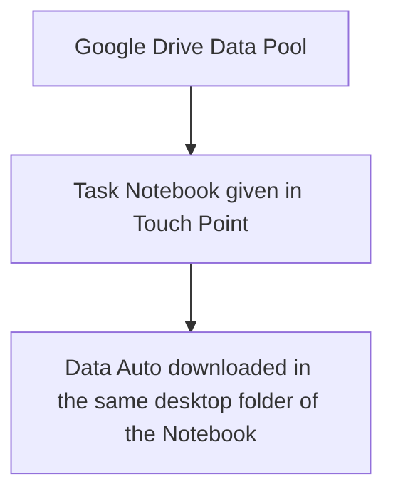
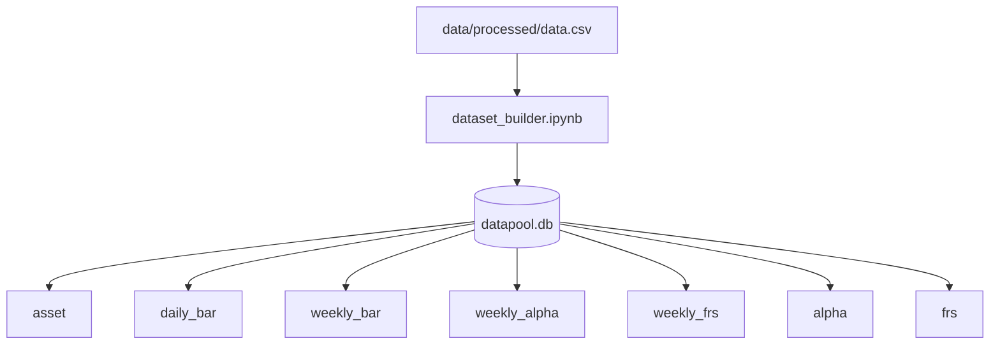

# Data Infra
## Workflow

## Data Framework

## SQLite Schema

### asset
| ticker | security_name | category |
|--------|--------------|----------|
| XLB | XLB US Equity | ETF |
| XLC | XLC US Equity | ETF |
| XLE | XLE US Equity | ETF |
| XLF | XLF US Equity | ETF |
| XLI | XLI US Equity | ETF |
| XLK | XLK US Equity | ETF |
| XLP | XLP US Equity | ETF |
| XLU | XLU US Equity | ETF |
| XLV | XLV US Equity | ETF |
| XLRE | XLRE US Equity | ETF |
| XLY | XLY US Equity | ETF |
| SPY | SPY US Equity | Benchmark |
| SPX | SPX Index | Benchmark |
| VIX | VIX Index | Index |
| USGG10YR | USGG10YR Index | Index |

### alpha
| alpha_id | alpha_name | applicable |
|----------|-----------|-----------|
| 1 | ... | GroupA / GroupB |

### frs
| frs_id | note |
|----------|------|
| 1 | 4-week total return |
| 2 | 4-week Sharpe ratio proxy |
| 3 | 4-week volatility-penalised return |

### daily_bar
| date | ticker | open | high | low | close | volume | tri |
|------|--------|------|------|-----|-------|--------|-----|
PK: (date, ticker) — FK: ticker → asset

### weekly_bar
| date | ticker | open | high | low | close | volume | tri |
|------|--------|------|------|-----|-------|--------|-----|
PK: (date, ticker) — W-WED resampled — FK: ticker → asset

### weekly_alpha
| date | ticker | alpha_id | value |
|------|--------|----------|-------|
PK: (date, ticker, alpha_id) — long format — FK: ticker → asset, alpha_id → alpha

### weekly_frs
| date | ticker | frs1 | frs2 | frs3 |
|------|--------|------|------|------|
PK: (date, ticker) — FK: ticker → asset

### FRS Definitions
Time Window: Next 4 WED close prices
- FRS1 — Total Return: (P_wk4 - P_wk0) / P_wk0
- FRS2 — Sharpe Ratio: avg(r_wk1,...,r_wk4) / std(r_wk1,...,r_wk4)
- FRS3 — Volatility Penalty Return: Return - beta × std(r_wk1,...,r_wk4)
### FRS
Time Window Next 4 WED close prices
- FRS1 - Total Return: $(P_{wk4}-P_{wk0})/P_{wk0}$
- FRS2 - Sharp Ratio: $(avg(r_{wk1},...,r_{wk4})/std(r_{wk1},...,r_{wk4}))$
- FRS3 - Valotility Penalty Return Total: $Return - beta * std(r_{wk1},...,r_{wk4})$
