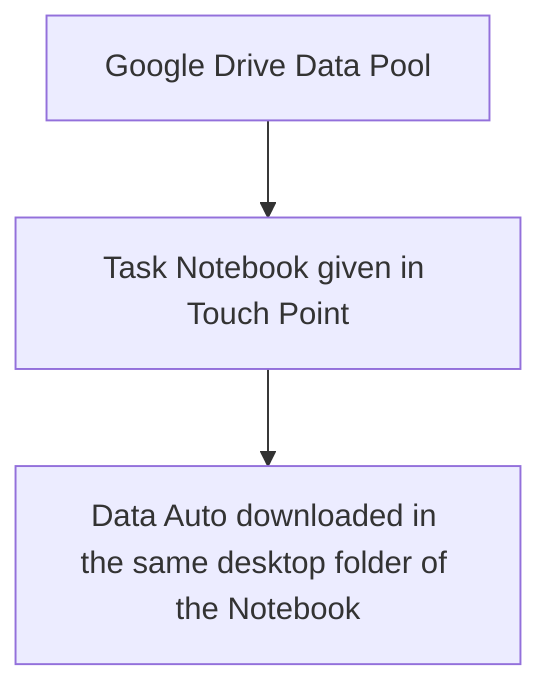
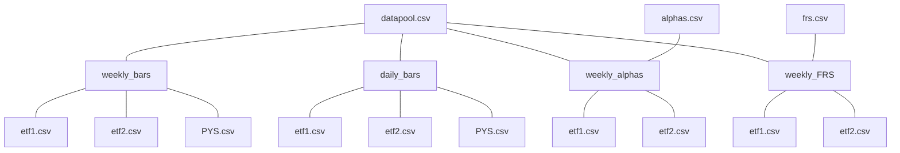

# Data Infra
## Workflow

## Data Framework

### ETF Name ENCODE
|TARGET_NAME|CODE|
|---|---|
|XLB US Equity PX|000001|

auto increment or SHA256

### FRS
Time Window Next 4 WED close prices
- FRS1 - Total Return: $(P_{wk4}-P_{wk0})/P_{wk0}$
- FRS2 - Sharp Ratio: $(avg(r_{wk1},...,r_{wk4})/std(r_{wk1},...,r_{wk4}))$
- FRS3 - Valotility Penalty Return Total: $Return - beta * std(r_{wk1},...,r_{wk4})$
