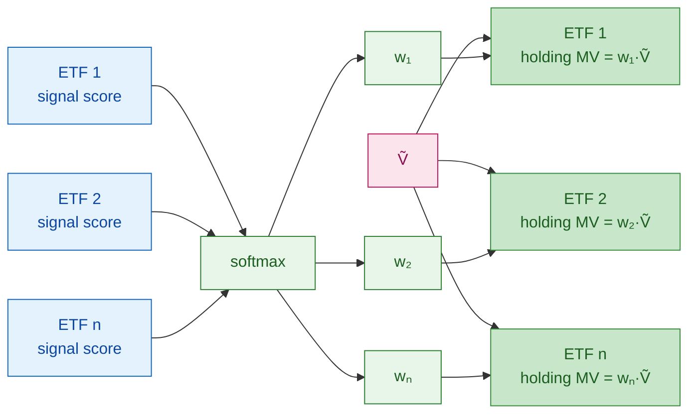
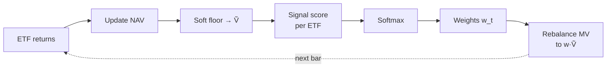

# Backtest Evaluation and Signal Optimization

**Code:** The strategy in §1–§2 lives in the strategy module as class **`SiganlOptimizationStrategy`** (long-only softmax allocator, soft floor, frictionless rebalance as specified below).

---

## 0. Equal-weight benchmark (baseline)

Before tuning any signal, establish a **frictionless equal-weight ETF baseline** as the mandatory floor for all Sharpe comparisons.

**Definition:** at every rebalance date, set $w_i = 1/N$ for all $N$ tradable ETFs. Equivalent to running `SiganlOptimizationStrategy` with a constant signal score for every ETF, since $\text{softmax}(c,\ldots,c) = [1/N,\ldots,1/N]$.

**Why equal-weight:** equal-weight is a strong null hypothesis for an ETF allocator — it is naive, cheap to implement, and empirically hard to beat on a risk-adjusted basis. A signal that cannot beat it adds no value.

**Implemented by:** `OptimizationTestSignal` (all scores = 1.0) + `SiganlOptimizationStrategy` in `backtests/signal_optimization/smoketest/`.

**Comparison table (report for every optimization run):**

| Metric | Equal-Weight (§0) | Strategy | Δ |
|--------|:-----------------:|:--------:|:-:|
| Sharpe Ratio | | | |
| Annual Return | | | |
| Annual Volatility | | | |
| Max Drawdown | | | |
| Turnover (ann.) | | | |

Use `QuantLab.backtest.benchmark.compare_metrics(baseline, candidate)` to populate this table.

---

## 1. Portfolio strategy

**Universe:** tradable **ETFs** at each rebalance date. **Long only.**

**Input:** one **signal score** per ETF, $s_i$ (higher → larger intended weight). No multi-signal mix inside this strategy class.

**Weights:** softmax over the ETF cross-section,

$$w_i = \frac{\exp(s_i)}{\sum_j \exp(s_j)}, \qquad w_i > 0,\ \sum_i w_i = 1.$$

**Dollar targets:** with deployable NAV $\tilde{V}$ after the soft floor (§2), target market value in ETF $i$ is $w_i \tilde{V}$.

**Orders:** let $\text{mv}_i$ be current MV in ETF $i$ before the trade; $d_i = w_i\tilde{V} - \text{mv}_i$. **Buy** if $d_i > 0$, **sell** if $d_i < 0$ (frictionless, fractional notionals). With **no fee**, trading only the $d_i$ is the same as **flatten to cash then reload** into the same softmax slices on $\tilde{V}$.

### Diagram: signal score → softmax → current holdings

### Wealth over time

Let $s_{t,i}$ be the signal score for ETF $i$ at $t$, $w_{t,i}$ the softmax weights, $V_t$ NAV after rebalance at $t$, $r_{t+1,i}$ simple return of ETF $i$ over $(t,t+1]$:

$$V_{t+1} = V_t \sum_i w_{t,i}(1 + r_{t+1,i}),$$

then rebalance to $w_{t+1}$ from the next signal scores.

### Period spine

---

## 2. Soft floor (numerical continuity)

To avoid zero or pathological negative notional when propagating the simulation (and to keep gradient-based paths defined when optimizing), apply a **soft floor** to the scalar used for sizing:

$$\tilde{V}_t = \max(V_t,\,\varepsilon), \quad \varepsilon = 10^{-6}$$

Implementation: **`cash = max(cash, eps)`** with **`eps = 1e-6`** when that variable is the deployable equity for sizing. **Document which variable is floored** so backtests and optimizers stay consistent.

**Semantics:** the floor is a **continuity device**, not an economic claim. Optionally log both raw $V_t$ and $\tilde{V}_t$ for reporting.

---

## 3. Backtest objective (evaluation score)

**Primary objective:**

$$\mathcal{L} = \text{Sharpe}(\text{portfolio}) - \lambda \cdot \text{Turnover}_{\text{ann}}$$

where $\lambda$ is a hyperparameter controlling the turnover penalty.

**Constraints and norms:**

- All runs use **zero fee, zero slippage** unless a friction sensitivity study is explicitly specified.
- Comparison is always relative to the **equal-weight baseline (§0)**. A run that does not beat §0 on Sharpe is treated as unsuccessful regardless of absolute value.
- Turnover is computed as $\sum_i |\Delta w_i| / 2$ per rebalance, annualized by multiplying by rebalance frequency.

**Extended metrics (report but do not optimize directly):** max drawdown, CAPM alpha vs SPY, win rate.

---

## 4. Optimization (outside the strategy class)

`SiganlOptimizationStrategy` only consumes **one signal score vector per date** (per ETF). The three optimization **steps** below are all ways to produce or tune that vector (or its generator); each run is scored by §3 and compared to §0.

### Step 1 — Single signal, signal quality pre-screening

- **Scores:** one signal stream $g_{t,i}$ per ETF (or one family with **very few** knobs, e.g. lookback $d$).
- **Pre-screen before backtest:** compute **Information Coefficient (IC)** — the cross-sectional rank correlation between $g_{t,i}$ and forward 1-period return $r_{t+1,i}$ — over the in-sample window. Signals with mean IC < 0.02 or IC-IR (IC mean / IC std) < 0.3 are unlikely to survive the full backtest; prune early.
- **Tuning:** grid / manual sweep / small search on those knobs.
- **Role:** baseline and sanity check on the backtest shell and on Sharpe − turnover before heavier optimizers.

### Step 2 — Multiple signals, linear mix + Bayesian optimization

- **Scores:** $s_{t,i} = \sum_k \alpha_k \, g^{(k)}_{t,i}$ with fixed streams $g^{(k)}$ and weights $\alpha_k$ (constraints as needed for identifiability).
- **Tuning:** **Bayesian optimization** (TPE / GP) over $\{\alpha_k\}$ and other **low-dimensional** hyperparameters (e.g. $\lambda$, lookback knobs). Typical search budget: 50–200 trials.
- **Regularization:** constrain $\sum_k |\alpha_k| \leq C$ or normalize $\alpha$ to the simplex to avoid degenerate single-signal solutions.
- **Validation:** use **walk-forward cross-validation** — train on rolling windows, evaluate on the following out-of-sample quarter. Report both in-sample and out-of-sample Sharpe to detect overfitting.
- **Role:** moderate dimension, expensive or noisy objective; **no** requirement for full end-to-end gradients through the simulator.

### Step 3 — Neural network wrapper

- **Scores:** a network outputs **logits per ETF** at each rebalance from features (and optional calendar inputs); logits are the **signal scores** fed into the same softmax → holdings path as §1.
- **Architecture choice:** start with a shallow MLP (2–3 layers) over lagged factor features; add attention or LSTM only if MLP IC is positive but insufficient.
- **Tuning:** **gradient-based** outer training when the unrolled backtest is differentiable (returns fixed w.r.t. net weights; soft floor as in §2). Avoid hard **argsort / top-k** in the allocation path — use softmax directly to preserve gradient flow.
- **Regularization:** L2 weight decay + dropout; clip gradient norm to 1.0. Monitor in-sample vs. out-of-sample Sharpe gap as the primary overfitting signal.
- **Role:** learn representations; backtest is the outer loss surface.

**Summary**

| Step | What is optimized | Typical method | Must beat |
|------|-------------------|----------------|-----------|
| 0 | — (equal weight, fixed) | — | — |
| 1 | Single signal (or tiny param set) | IC screen + grid sweep | Step 0 |
| 2 | Linear mix $\sum_k \alpha_k g^{(k)}$ + low-dim hyperparams | Bayesian optimization + walk-forward CV | Steps 0–1 |
| 3 | Network parameters $\theta$ producing per-ETF logits | SGD / Adam + differentiable backtest | Steps 0–2 |

---

## 5. Differentiability (brief)

**Step 3:** relevant when scores are **smooth in $\theta$** and the path stays **continuous** (soft floor, no hard sort / integer lots). **Steps 1–2:** usually treat the backtest as a **black box**.

---

## 6. New ideas and extensions

### 6.1 Signal decay and staleness

A signal computed from $d$-day lookback has a natural decay horizon. Measure **IC decay** — plot $\text{IC}(\tau)$ for forward returns at lag $\tau = 1, 2, \ldots, 20$ bars. If IC drops to zero within a few periods, the signal should not be used with a longer rebalance frequency.

### 6.2 Turnover-aware softmax temperature

Replace the raw softmax with a **temperature-scaled** softmax:

$$w_i = \frac{\exp(s_i / T)}{\sum_j \exp(s_j / T)}$$

High $T \to 1$: converges toward equal weight, reduces turnover.  
Low $T \to 0$: concentrates weight on the top-ranked ETF, increases turnover.

$T$ becomes an additional hyperparameter in Steps 1–2 (add to Bayesian search space) and a learnable scalar in Step 3.

### 6.3 Ensemble diversification bonus

For Step 2, augment the linear mix objective with a **diversification penalty**:

$$\mathcal{L}_{\text{ens}} = \mathcal{L} - \mu \cdot \overline{\rho}(\{g^{(k)}\})$$

where $\overline{\rho}$ is the mean pairwise IC correlation between signals. This encourages the optimizer to select signals that are jointly uncorrelated, not just individually strong.

### 6.4 Walk-forward regime detection (optional for Step 2/3)

Fit a 2-state HMM on realized volatility to label each rebalance period as "low-vol" or "high-vol" regime. Train separate $\alpha_k$ weights (or separate network heads) per regime, and switch at test time based on the current regime label. Regimes typically improve out-of-sample Sharpe by 5–15% in ETF studies.

### 6.5 Transaction cost sensitivity study

Before moving from Step 0 to production, run a friction sweep: repeat each backtest with `long_cost ∈ {0, 5, 10, 20}` bps. Report the break-even cost at which Sharpe falls below the equal-weight baseline. This is the **cost budget** the live trading infrastructure must stay under.
